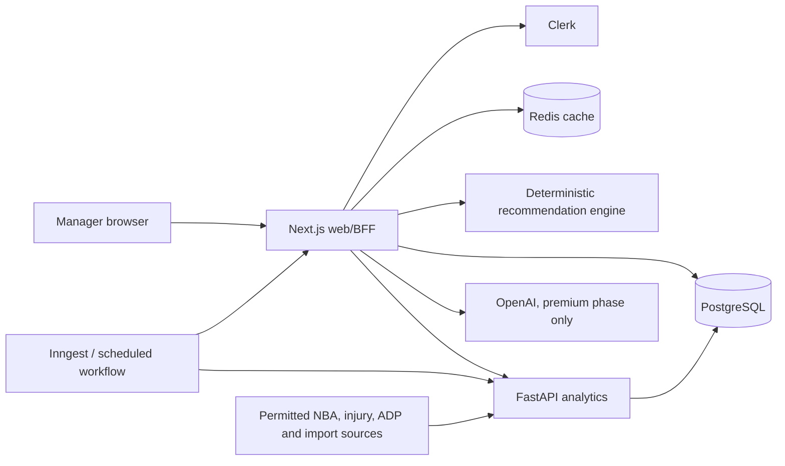

# DraftCourt — Codex Build Specification

> Status: implementation contract  
> Target season: 2026–27 NBA  
> Product: platform-independent NBA fantasy live draft assistant  
> Working title: **DraftCourt** (rename only through a single branding configuration)  
> Last updated: 2026-08-22

## 0. How Codex must use this document

This file is the source of truth for implementation. Build the phases in order and do not begin a later phase until the current phase's code, migrations, tests, documentation, and acceptance criteria pass. Update the checklist in section 24 as work is completed.

Rules:

1. Do not ship placeholder screens, fake production logic, unhandled `TODO` branches, disabled tests, or hard-coded recommendation results.
2. Demo fixtures are allowed only behind explicit demo/test configuration and must be visibly labeled.
3. Stop and fix type errors, lint errors, migration failures, security test failures, failing tests, and production-build errors before continuing.
4. Keep the recommendation result reproducible: the same data snapshot, league, roster, preferences, and engine version must produce the same scores.
5. Every externally sourced fact must carry source, source record ID or URL, fetched time, and applicable attribution.
6. Do not scrape or automate a source when its terms, robots policy, or license prohibit it. Add an adapter and use a permitted API, export, public report, or admin import instead.
7. Never expose provider secrets, Clerk user identifiers, private leagues, draft share tokens, or paid AI prompts/results to unauthorized users.
8. Prefer small, reviewable vertical slices. Commit schema, code, tests, fixtures, and docs together.
9. If a repository dependency conflicts with this specification, document the conflict in an ADR and choose the safest maintainable option; do not silently improvise.
10. Use the existing Graphify knowledge graph before broad file searches or architecture-impact analysis. Query the graph first, inspect only the scoped source paths it identifies, and refresh the graph after material structural changes.
11. For user-facing frontend work, use the project-scoped Impeccable design workflow defined in section 10.5. Design context, critique reports, and accepted design decisions are versioned artifacts; screenshots, caches, and per-developer live-session state are not.

## 1. Product definition

DraftCourt answers one question during a live fantasy draft:

> Given the players already selected, my roster, league rules, future projections, market behavior, and preferences, who are my best three choices right now?

Primary outcomes, in order:

1. improve roster fit;
2. capture draft value;
3. maximize expected probability of winning the league.

The first working release is a live, platform-independent, manually operated snake-draft assistant. It supports points and custom-category leagues, normal redraft, keeper, and dynasty context. The architecture is NBA-specific at first, but sport-specific vocabulary belongs in the domain layer rather than UI primitives so another sport can be added later.

### 1.1 Personas

- **Guest evaluator:** browses players and runs a disposable CPU mock draft with demo settings.
- **Signed-in manager:** creates leagues, saves preferences, conducts real or mock drafts, and reviews history.
- **Premium manager:** uses a grounded OpenAI assistant and natural-language strategy controls.
- **Admin:** edits projection overrides and flags injuries, transactions, and role changes; cannot trigger ingestion jobs or view raw job errors in the initial product.

### 1.2 Scope for the first working MVP

The MVP includes:

- account authentication with Clerk for real drafts;
- guest player browsing and one disposable mock-draft flow;
- manual league setup for points or custom-category snake leagues;
- roster slots including PG, SG, SF, PF, C, G, F, UTIL, and BENCH;
- keeper/dynasty flags and retained-player setup;
- a searchable player pool with projections, ranks, ADP, risk, and drafted state;
- a complete visual board for all teams;
- manual click and search-to-draft, undo, pause, resume, and event replay;
- three instant, explainable recommendations with score and labels;
- user's roster always visible;
- CPU mock opponents with configurable personalities;
- saved leagues, preferences, drafts, favorite/target/avoid lists, and custom ranks;
- a post-draft grade with roster strengths and weaknesses;
- light/dark responsive UI, keyboard controls, accessibility, and reduced motion;
- seed/demo data, ingestion foundations, observability, CI, and deployment docs.

### 1.3 Explicitly deferred from MVP

- direct ESPN/Yahoo/Sleeper/Fantrax integrations;
- auction/salary-cap drafts;
- shared multi-manager rooms, spectators, chat, and collaborative editing;
- production news sentiment automation and automatic depth-chart interpretation;
- fully trained production ensemble if 2026–27 training inputs are not ready (MVP uses a versioned, tested weighted baseline);
- paid OpenAI assistant;
- trade and waiver recommendations during the season;
- mobile native apps;
- billing implementation (premium gates may exist but must remain off until billing is built);
- automatic admin ingestion controls and raw ingestion-error UI.

These are later phases, not forgotten requirements.

## 2. Functional decisions

### 2.1 League and draft rules

- Platform-independent; users manually enter settings.
- Points and custom-category scoring are first-class modes.
- Include presets for common 8-category and 9-category formats, but persist the expanded custom configuration.
- Custom points weights and category weights are allowed. Category direction is explicit (`HIGHER_BETTER` or `LOWER_BETTER`).
- Punt categories are configured as zero or reduced category weights, never inferred without consent.
- Snake drafts only initially. Calculate the exact current/next user pick from team count, draft slot, round, and direction.
- Roster and bench limits affect eligibility, scarcity, and recommendation score.
- Keeper players are inserted as immutable pre-draft events with optional keeper cost. Dynasty mode increases age/upside weights through a visible preset; all weights remain editable.
- A real draft requires an account. Guests may browse profiles and use demo mock drafts.
- Drafts are private by default. A signed-in owner may generate a revocable, unguessable, read-only result link after the draft; no live spectators.

### 2.2 Preferences

Expose advanced controls without overwhelming the default flow. Provide these presets:

- Balanced;
- Best Player Available;
- Positional Balance;
- Win Now;
- Dynasty Youth;
- High Upside;
- Low Risk;
- Zero-RB-style equivalent: Guard Heavy;
- Big-Man Build;
- Threes and Scoring;
- Defensive Categories;
- Punt Strategy (user selects categories);
- Schedule Optimizer.

Users can edit factor importance, risk tolerance, age curve, upside, playoff schedule, favorite/disliked teams, favorite/disliked players, rookies/veterans/breakouts, position priorities, target/avoid lists, and custom player ranks. Preferences persist per user and can be overridden per league/draft.

The default factor priority is:

1. projected fantasy production;
2. positional scarcity;
3. roster need;
4. injury risk;
5. consistency;
6. age;
7. ADP value;
8. upside;
9. role/minutes;
10. probability of surviving to the next pick;
11. personal preference.

Convert an ordinal priority `r` among `n` factors to a starting weight using reciprocal rank, `raw = 1/r`, then normalize all raw values to sum to 1. Sliders show percentages and re-normalize unlocked factors. Avoid players receive a hard exclusion by default; users may change this to a severe penalty. Targets are boosted but never allowed to exceed the configured preference-weight ceiling.

### 2.3 Recommendation output

After each event, display exactly three primary recommendations, plus the sortable full player pool. Each recommendation has:

- player, projected line, eligible positions, injury state, market ADP, internal rank;
- `draftScore` from 0–100 and score-component breakdown;
- one concise sentence grounded in the actual top positive and negative components;
- confidence and risk bands;
- estimated availability at the user's next pick;
- at least one badge chosen from Best Overall, Best Fit, Best Value, Highest Upside, Safest Pick;
- a warning when the pick is materially above ADP, with the fit-based reason;
- data snapshot and engine version available in a details drawer.

## 3. Technical architecture

Use a pnpm/Turborepo monorepo.

```text
draftcourt/
├── apps/
│   └── web/                         # Next.js App Router, React, TypeScript
│       ├── app/
│       ├── components/
│       ├── features/
│       ├── lib/
│       ├── public/
│       └── tests/
├── services/
│   └── analytics/                   # Python, FastAPI, projections/evaluation
│       ├── app/
│       │   ├── api/
│       │   ├── domain/
│       │   ├── ingestion/
│       │   ├── models/
│       │   └── pipelines/
│       └── tests/
├── packages/
│   ├── db/                          # Prisma schema/client/seed; sole migration owner
│   ├── domain/                      # shared TS contracts, scoring and pure utilities
│   ├── ui/                          # DraftCourt design system over Astryx primitives
│   ├── config-eslint/
│   └── config-typescript/
├── data/
│   ├── demo/                        # licensed/synthetic recruiter-ready fixture
│   ├── schemas/                     # JSON Schema exchanged with Python
│   └── attribution/
├── models/                          # model cards and small metadata; no large binaries
├── infra/
│   ├── docker/
│   └── monitoring/
├── docs/
│   ├── adr/
│   ├── architecture/
│   ├── data-sources.md
│   ├── recommendation-engine.md
│   └── runbooks/
├── .github/workflows/
├── docker-compose.yml
├── .env.example
├── BUILD_SPEC.md
└── README.md
```

### 3.1 Chosen stack

- **Web:** Next.js App Router, React 19+, strict TypeScript, Tailwind CSS, Astryx stable React primitives, TanStack Query for server state, Zustand only for transient live-draft UI state, React Hook Form + Zod.
- **Animation:** Motion for React for interactive/interruptible springs; Anime.js v4 only for decorative SVG/data-viz timelines that Motion does not express cleanly. Never animate the same property with both libraries.
- **Agent code intelligence:** Graphify is the query-first architecture map for OpenCode and other coding agents. Its already-built local graph is a navigation aid, not a replacement for verifying the relevant source and tests before editing.
- **Design workflow:** Impeccable is the required AI design-language and deterministic frontend-audit layer. It guides shaping, critique, hardening, responsive/accessibility review, and polish; it is not a runtime UI dependency and does not replace Astryx, DraftCourt tokens, Motion, Playwright, axe, or human judgment.
- **Database:** PostgreSQL on Neon for preview/production; local PostgreSQL in Docker Compose.
- **ORM:** Prisma owns schema and migrations. Python uses SQLAlchemy Core/read models where batch access is necessary; it never creates migrations. JSON Schema contract tests prevent drift.
- **Cache/rate limits:** Upstash Redis in deployed environments; local Redis in Compose. The application must still serve uncached reads if Redis is unavailable, but drafting writes remain database-authoritative.
- **Analytics:** FastAPI, Pydantic, pandas/polars, scikit-learn, LightGBM, Optuna, MLflow file artifacts in development. Package versions are locked.
- **Jobs:** Inngest functions initiate scheduled/ad-hoc workflows. Long Python training/ingestion jobs run in the analytics service; job status is stored in PostgreSQL. GitHub Actions scheduled workflows are a fallback for non-time-critical nightly refreshes.
- **Auth:** Clerk. Mirror the minimum user profile into `User`; Clerk remains the identity source.
- **Validation:** Zod at every TypeScript boundary and Pydantic at every Python boundary.
- **Testing:** Vitest, React Testing Library, Playwright, Pytest, Testcontainers, axe-core, Schemathesis for FastAPI.
- **Observability:** Sentry in web and analytics, structured JSON logs, OpenTelemetry trace IDs, Vercel analytics only after consent.
- **Deployment:** Vercel (web), Neon (PostgreSQL), Upstash (Redis), Render Docker web service (FastAPI initially). Free tiers are acceptable for demo/staging; production must document cold starts and upgrade thresholds.
- **Toolchain:** pnpm, Ruff, mypy, ESLint, Prettier, commit-independent GitHub Actions.

### 3.2 Service boundaries

- Browsers communicate only with Next.js route handlers/server actions.
- Next.js owns auth, authorization, draft transactions, league CRUD, public read models, rate limits, and recommendation orchestration.
- The analytics service accepts authenticated service-to-service requests for projection computation, model evaluation, and bulk feature work. It is not public to browsers.
- The deterministic recommendation engine lives in `packages/domain` so it can run server-side quickly and be unit-tested without infrastructure. The server is authoritative; the client may compute a preview from the same pure package while awaiting the server.
- PostgreSQL is authoritative. Redis stores derived cache entries, rate-limit counters, and short-lived recommendation results only.

### 3.3 High-level flow



## 4. Data model

Use UUIDv7 identifiers where supported, UTC `timestamptz`, `Decimal` for externally meaningful numeric weights/percentages, JSONB only for source payloads or evolvable model metadata, and explicit enums/check constraints for domain state. All owner-scoped tables include an indexed `userId` and are authorized at the service layer.

### 4.1 Core enums

```ts
type UserRole = 'USER' | 'ADMIN';
type LeagueType = 'POINTS' | 'CATEGORIES';
type LeagueHorizon = 'REDRAFT' | 'KEEPER' | 'DYNASTY';
type DraftType = 'REAL' | 'MOCK' | 'DEMO';
type DraftStatus = 'SETUP' | 'ACTIVE' | 'PAUSED' | 'COMPLETED' | 'ABANDONED';
type DraftEventType = 'DRAFT_STARTED' | 'PLAYER_DRAFTED' | 'PICK_UNDONE' | 'DRAFT_PAUSED' | 'DRAFT_RESUMED' | 'DRAFT_COMPLETED';
type Position = 'PG' | 'SG' | 'SF' | 'PF' | 'C' | 'G' | 'F' | 'UTIL' | 'BENCH';
type Direction = 'HIGHER_BETTER' | 'LOWER_BETTER';
type Availability = 'ACTIVE' | 'INJURED' | 'SUSPENDED' | 'UNSIGNED' | 'RETIRED';
type PreferenceListType = 'FAVORITE' | 'DISLIKED' | 'TARGET' | 'AVOID';
```

### 4.2 Required tables

| Table | Essential fields and constraints |
| --- | --- |
| `User` | `id`, unique `clerkUserId`, `role`, `plan`, locale/timezone, timestamps |
| `UserPreferenceProfile` | owner, name, preset, factor weights JSON validated against schema, risk/upside/age/schedule controls, default flag |
| `PreferencePlayer` | profile, player, type, magnitude; unique composite |
| `PreferenceTeam` | profile, NBA team, favorite/disliked magnitude; unique composite |
| `League` | owner, name, season, type, horizon, team count 4–20, user's draft slot, rounds, playoff weeks, private flag, active settings version |
| `LeagueSettingsVersion` | immutable settings snapshot: categories/points weights, roster slots, constraints, created time |
| `LeagueTeam` | league, slot, display name, marks user's team, CPU personality for mocks; unique league+slot |
| `RosterSlotRule` | settings version, position, count, starter/bench flag |
| `ScoringRule` | settings version, stat key, weight, direction, enabled, punt flag |
| `NbaTeam` | stable provider IDs, abbreviation, names, colors, logo metadata |
| `Player` | stable internal ID, provider IDs, slug, legal/display names, DOB, height, status, unsigned label, current team, image metadata |
| `PlayerEligibility` | player, season, eligible position; unique composite |
| `PlayerSeasonStat` | player, season, scope (`NBA`/`COLLEGE`/`INTERNATIONAL`), games, minutes and counting/shooting totals/rates, source lineage |
| `PlayerNewsSignal` | player, injury/transaction/role/sentiment type, bounded impact, confidence, effective/expiry time, source; admin override supported |
| `DataSource` | name, adapter, terms URL, attribution, enabled, permitted uses, last compliance review |
| `IngestionRun` | source, job type, status, counts, started/finished times, checksum; detailed errors stay in logs/Sentry, not admin UI |
| `RawSourceRecord` | source, external key, fetched time, checksum, compressed payload/ref, processing status |
| `AdpObservation` | player, source, format, season, sample size, ADP, rank, captured time |
| `AdpConsensusSnapshot` | season/format/time, methodology version |
| `AdpConsensusPlayer` | snapshot, player, consensus ADP, dispersion, sources count, value confidence |
| `ProjectionModel` | model key/version, algorithm, feature schema hash, training window, metrics, artifact URI/checksum, lifecycle status |
| `ProjectionRun` | model, season, data cutoff, reason, status, immutable run metadata |
| `PlayerProjection` | run/player, games, minutes, PTS/REB/AST/STL/BLK/TOV/FGM/FGA/FTM/FTA/3PM, intervals, risk, role/upside scores; unique run+player |
| `ProjectionOverride` | admin, player, season/stat, delta or replacement, rationale, effective/expiry, audit times |
| `Draft` | owner nullable only for expiring demo, league/settings snapshot, type/status, current sequence, next pick, engine/data/model versions, share token hash, optimistic `version` |
| `DraftTeam` | immutable copy of league team for replay, slot, user flag, CPU strategy |
| `DraftEvent` | draft, monotonic sequence, event type, actor, pick/round/team/player, causation event, idempotency key, payload, timestamp; unique draft+sequence and draft+idempotency key |
| `DraftRosterAssignment` | materialized current view: draft/team/player/slot, source event; unique draft+player |
| `RecommendationSnapshot` | draft, sequence, user team, engine version, input checksum, requested time, latency, complete score payload |
| `CustomPlayerRank` | owner, league optional, player, rank/tier/note |
| `DraftAnalysis` | draft, grade, percentile assumptions, category/position strengths and weaknesses, generated time/version |
| `AuditLog` | actor, action, entity, before/after redacted JSON, trace ID, timestamp |
| `AiUsage` | user, request kind, model, input/output token counts, estimated cost, status, date bucket; prompts stored only with explicit consent |

### 4.3 Important indexes

- `Player(slug)`, provider IDs, normalized display name trigram/search index.
- `PlayerSeasonStat(playerId, season)`, `PlayerProjection(runId, playerId)`.
- `DraftEvent(draftId, sequence)`, `DraftEvent(draftId, playerId)` partial for drafted picks.
- `Draft(ownerId, updatedAt desc)`, `League(ownerId, updatedAt desc)`.
- `AdpObservation(season, format, capturedAt desc, playerId)`.
- `PlayerNewsSignal(playerId, effectiveAt desc)` and active partial index by expiry.
- `RecommendationSnapshot(draftId, sequence desc)`.

### 4.4 Event and undo invariants

- Never delete a draft event.
- `PICK_UNDONE` references the active `PLAYER_DRAFTED` event in `causationEventId`.
- A player is available iff their latest effective selection event has not been undone.
- Undo is allowed only for the latest effective pick in MVP. Later arbitrary correction requires a new audited correction event and deterministic replay.
- Append event, update materialized roster, advance/reverse pick cursor, increment draft version, and write an outbox/job request in one database transaction.
- Require `Idempotency-Key` and `If-Match: <draft version>` for mutations. Return 409 with current state on collision.

## 5. Shared contracts

Place exact Zod schemas and generated JSON Schema in `packages/domain`/`data/schemas`; Python Pydantic models must validate against the same fixtures.

```ts
interface LeagueScoringRule {
  stat: 'PTS' | 'REB' | 'AST' | 'STL' | 'BLK' | 'TOV' | 'FG_PCT' | 'FT_PCT' | 'THREE_PM' | string;
  weight: number;
  direction: Direction;
  punt: boolean;
}

interface ProjectedLine {
  playerId: string;
  games: number;
  minutesPerGame: number;
  pts: number; reb: number; ast: number; stl: number; blk: number; tov: number;
  fgm: number; fga: number; ftm: number; fta: number; threePm: number;
  lower80: Record<string, number>;
  upper80: Record<string, number>;
  injuryRisk: number; consistency: number; upside: number; roleSecurity: number;
}

interface ScoreComponent {
  key: 'production' | 'scarcity' | 'rosterNeed' | 'risk' | 'consistency' | 'age' | 'adpValue' | 'upside' | 'role' | 'nextPickAvailability' | 'preference' | 'schedule';
  raw: number; normalized: number; weight: number; contribution: number;
  reason: string;
}

interface Recommendation {
  playerId: string;
  rank: 1 | 2 | 3;
  draftScore: number;
  labels: Array<'BEST_OVERALL' | 'BEST_FIT' | 'BEST_VALUE' | 'HIGHEST_UPSIDE' | 'SAFEST_PICK'>;
  explanation: string;
  availabilityNextPick: number;
  confidence: 'LOW' | 'MEDIUM' | 'HIGH';
  components: ScoreComponent[];
  engineVersion: string;
  projectionRunId: string;
  inputChecksum: string;
}
```

## 6. Recommendation engine

### 6.1 Inputs and reproducibility

Inputs are the immutable league settings version, active draft events through sequence `s`, projection run, ADP snapshot, active signals/overrides, user preference snapshot, and engine version. Canonically sort JSON keys/arrays, hash the input, and store the checksum.

Exclude drafted, retired, and hard-avoided players. Unsigned players remain visible and recommendable only when the user enables `includeUnsigned`; show a prominent warning. A player is eligible if at least one valid final roster assignment exists after selecting them. Bench/UTIL capacity counts but cannot fully erase starter scarcity.

### 6.2 Projected production

For points leagues:

```text
seasonFantasyPoints = Σ(projectedStatTotal_k × leagueWeight_k)
perGame = seasonFantasyPoints / projectedGames
production = 0.65 × percentile(perGame) + 0.35 × percentile(seasonFantasyPoints)
```

For category leagues, use a replacement-relative z-score. Counting categories use projected per-game value multiplied by a reliability factor `sqrt(projectedGames / 82)`. Turnovers reverse sign when lower is better.

Percentage categories must be volume-aware:

```text
fgImpact = (projectedFGM - poolBaselineFGPct × projectedFGA) / sd(fgImpact in eligible pool)
ftImpact = (projectedFTM - poolBaselineFTPct × projectedFTA) / sd(ftImpact in eligible pool)
```

Calculate category utility after punt/category weights. Winsorize source features at the 2nd/98th percentiles; convert each component to a 0–1 percentile within the current eligible pool.

### 6.3 Positional scarcity

For every roster slot, estimate replacement value as the projected utility of the player expected to be available when the last league starter for that slot is filled. Multi-position assignment uses maximum-weight bipartite matching between roster slots and players. A candidate's scarcity is their best marginal utility above replacement across eligible assignments, with a reduced multiplier for UTIL and BENCH.

### 6.4 Roster need and diminishing returns

Simulate adding the candidate, solve the roster assignment, and compute:

- required-slot coverage improvement;
- projected team category vector relative to a replacement-built opponent baseline;
- marginal category win-probability improvement using a logistic transform;
- diminishing returns: value approaches zero as category win probability approaches 0.85 and increases around competitive categories near 0.5;
- punt categories contribute zero.

For points leagues, roster need emphasizes legal slot completion and value above replacement. For category leagues it also rewards complementary category profiles and penalizes destructive percentage/turnover effects.

### 6.5 Risk, consistency, age, upside, role, preference, schedule

- `risk`: injury probability, games interval width, role uncertainty, and historical availability. Convert to a positive safety score before weighting.
- `consistency`: inverse game-level coefficient of variation adjusted for role changes.
- `age`: neutral in redraft by default; dynasty uses a position-agnostic learned age curve until enough data exists for positional curves.
- `upside`: upper-quantile projection minus median, bounded and reliability-adjusted.
- `role`: projected minutes, starter probability, usage stability, transaction/role signals.
- `preference`: bounded `[-1, 1]` sum of targets, favorites, disliked entities, archetype preferences, and custom rank delta. It may contribute no more than 10 score points by default.
- `schedule`: off by default. When enabled, use games in configured fantasy playoff weeks, back-to-backs, and low-volume days; show data freshness.
- Do not penalize multiple players from the same NBA team.

### 6.6 ADP value and next-pick availability

Create consensus ADP only from permitted APIs, licensed datasets, user/admin CSV imports, or platform exports. Normalize each source to draft slot and combine with a sample-size-weighted trimmed mean. Store dispersion and source count; confidence is low with fewer than two sources.

`adpValue = percentile(consensusADP - currentOverallPick)` after bounding extreme differences. Display `internalRank - marketRank` and an explicit value-above-ADP indicator.

Estimate availability with a deterministic seeded Monte Carlo simulation (250 runs live, 2,000 offline evaluation):

1. simulate every intervening CPU/opponent pick;
2. opponent probability is a softmax of ADP, base projection, roster need, and a team personality vector;
3. update a lightweight Bayesian tendency vector from actual picks in this draft;
4. availability is the fraction of simulations in which the player reaches the user's next selection.

The urgency feature is `1 - P(available next pick)`. Despite its requested rank of tenth, it is used as a tie-breaker when total scores differ by less than one point.

### 6.7 Lookahead

Optimize the current pick while considering the rest of the draft. For the top 20 candidates by base utility, run a shallow two-user-pick rollout using the same seeded opponent model. Add at most 10% of the normalized expected next-pick roster utility to the current-pick total. This prevents greedy positional traps without turning the live path into an expensive full-draft optimizer.

### 6.8 Final score

```text
base = Σ(weight_i × normalizedComponent_i)
lookaheadBonus = 0.10 × expectedNextPickUtility
rawScore = 100 × clamp(base + lookaheadBonus, 0, 1)
draftScore = round(rawScore, 1)
```

Compute components before rounding. Break ties by production, scarcity, ADP value, then stable player ID. Generate explanations from deterministic templates using the two largest positive contributions and largest material caveat. LLM text is never required for core explanations.

Labels are relative to the current pool: highest production = Best Overall; highest roster-need/scarcity composite = Best Fit; highest positive ADP gap = Best Value; highest upside = Highest Upside; highest safety/consistency composite = Safest Pick. A top-three player may hold multiple labels.

### 6.9 Performance targets

- p95 server recommendation latency under 300 ms for a 12-team, 16-round draft with 600 players after warm cache.
- p95 under 800 ms without a cached snapshot, excluding a cold infrastructure start.
- pick mutation acknowledged under 250 ms p95; recommendations may update asynchronously but must show a calculating state and arrive within 1 second p95.
- deterministic snapshot test equality across Node platforms.

## 7. Projection and machine-learning strategy

### 7.1 Targets

Predict games played, minutes/game, and per-minute or opportunity-normalized PTS, REB, AST, STL, BLK, TOV, FGM, FGA, FTM, FTA, and 3PM. Derive percentage projections from makes/attempts, never average percentage columns directly. Produce median plus 10th/90th or calibrated 80% intervals, injury risk, role security, and upside.

### 7.2 Data pipeline

Pipeline stages are `extract -> quarantine -> validate -> normalize -> reconcile identities -> feature build -> train/predict -> evaluate -> publish`. Raw records are immutable and checksum-addressed. Invalid rows go to quarantine and do not silently coerce. Publishing a run is atomic.

Initial sources/adapters:

- NBA statistics through a documented/permitted endpoint or `nba_api` adapter with aggressive caching and backoff; never call it on page requests.
- NBA schedules/team/player metadata from a permitted NBA/static source, with source health checks.
- official public NBA injury reports where reuse is permitted; otherwise admin import/override.
- ADP adapter interface plus CSV import; do not claim multi-platform consensus until at least two valid sources exist.
- college/international rookie CSV import using documented translation factors and provenance. Do not scrape prohibited sites.
- player photos/logos through a permitted external CDN/provider; provide initials/team-color fallback and attribution.

Refresh policy:

- player/team metadata weekly and on admin-approved release deployment;
- regular-season stats nightly at 06:00 UTC;
- injuries every 60 minutes during the season and every 6 hours offseason, subject to source limits;
- transactions/role signals every 6 hours;
- ADP daily during the eight weeks before the season, weekly otherwise;
- projections after a successful nightly refresh and immediately after a material approved override;
- full training weekly in preseason, monthly in-season; lightweight prediction refresh daily.

### 7.3 Models

Benchmark on rolling, time-based season splits only—never random row splits:

1. exponentially weighted three-season baseline with age/role adjustments;
2. Elastic Net multi-target/stat-specific regressors;
3. gradient-boosted trees (LightGBM) per target;
4. calibrated ensemble weighted by out-of-time validation performance.

Features include lagged rate/total stats, minutes and usage proxies, games/availability, age, experience, team/role continuity, transactions, teammate opportunity changes, draft pedigree, rookie competition level and translation, injury history, and signal confidence. Do not include post-cutoff data.

Rookies use a separate model when sample size supports it; otherwise use position/competition translation factors, age, draft capital, and role priors with deliberately wide intervals. Unsigned players get reduced games/minutes and low role-confidence priors.

### 7.4 Model selection and evaluation

Primary metrics:

- minutes-weighted MAE for each per-game stat;
- fantasy-points MAE under standard scoring;
- Spearman rank correlation for player ranking;
- interval coverage/calibration;
- games-played MAE and Brier score for meaningful-absence risk.

Secondary metrics are RMSE (tail sensitivity), category z-score MAE, top-25/top-100 rank overlap, and subgroup errors for rookies, veterans, injured players, and low-minute players. Select the ensemble only if it beats the weighted baseline on fantasy-points MAE and Spearman correlation across at least two rolling validation seasons without materially worse calibration. Otherwise publish the simpler model.

Every model has a model card with training cutoff, features, metrics, limitations, licensing, artifact checksum, and rollback instructions. Store all published historical projections and compare them with actual results at season end.

### 7.5 News and manual signals

Sentiment cannot directly change projections. A permitted news item may create a proposed typed signal (`INJURY`, `TRADE`, `STARTER_CHANGE`, `ROLE_UP`, `ROLE_DOWN`) with impact, confidence, evidence, and expiry. Admin-approved or high-confidence structured signals enter feature computation. Every adjustment appears in the projection audit trail.

## 8. API contract

All routes are under `/api/v1`, return JSON using `{ data, error, meta }`, include `traceId`, and use RFC 9457-style problem details. Cursor pagination is required for lists. Validate input/output. Owner authorization happens after authentication and before database access where practical.

### 8.1 Public/guest

| Method | Route | Purpose |
| --- | --- | --- |
| GET | `/players` | search/filter/sort players; public safe projection fields |
| GET | `/players/:slug` | player profile |
| POST | `/players/compare` | compare 2–4 player IDs |
| GET | `/rankings` | public/demo ranking snapshot |
| GET | `/data-sources` | attribution and freshness |
| POST | `/demo-drafts` | create expiring, rate-limited demo mock |

### 8.2 Authenticated user

| Method | Route | Purpose |
| --- | --- | --- |
| GET/POST | `/leagues` | list/create league |
| GET/PATCH/DELETE | `/leagues/:id` | owner-only league operations |
| POST | `/leagues/:id/clone` | clone configuration |
| GET/POST | `/preference-profiles` | list/create profiles |
| GET/PATCH/DELETE | `/preference-profiles/:id` | manage profile |
| GET/PUT | `/custom-ranks` | retrieve/replace ranks transactionally |
| GET/POST | `/drafts` | list/create real or mock draft |
| GET | `/drafts/:id` | current read model and version |
| POST | `/drafts/:id/start` | validate and start |
| POST | `/drafts/:id/picks` | append pick with idempotency/version |
| POST | `/drafts/:id/undo` | compensate latest effective pick |
| POST | `/drafts/:id/pause` | pause |
| POST | `/drafts/:id/resume` | resume |
| POST | `/drafts/:id/cpu-pick` | owner mock only |
| GET | `/drafts/:id/events` | cursor event history/replay |
| GET | `/drafts/:id/recommendations` | top 3/full breakdown at current sequence |
| POST | `/drafts/:id/recommendations/recalculate` | force new snapshot, rate limited |
| POST/DELETE | `/drafts/:id/share` | create/revoke completed read-only share token |
| GET | `/drafts/:id/analysis` | post-draft grade |
| GET | `/me/history` | draft and mock history |

### 8.3 Admin

| Method | Route | Purpose |
| --- | --- | --- |
| GET | `/admin/model-performance` | model runs/metrics, no raw job errors |
| GET/POST/PATCH | `/admin/projection-overrides` | audited manual projection adjustment |
| GET/POST/PATCH | `/admin/player-signals` | injury/trade/role flags |
| GET | `/admin/audit-log` | filtered audit trail |

Do not add ingestion-trigger or raw-error endpoints to the initial admin product.

### 8.4 Analytics internal API

Require a rotating service token or signed request, private network where available, request timestamp, replay window, and schema version.

| Method | Route | Purpose |
| --- | --- | --- |
| GET | `/health/live` | process liveness |
| GET | `/health/ready` | dependency/model readiness |
| POST | `/internal/v1/projections/run` | start prediction run |
| POST | `/internal/v1/models/train` | start training run |
| POST | `/internal/v1/models/evaluate` | evaluate a run |
| POST | `/internal/v1/ingestion/:source` | scheduled adapter execution |
| GET | `/internal/v1/jobs/:id` | machine-readable job state |

## 9. Page routes and UX

### 9.1 Route map

```text
/                         marketing and product explanation
/players                  searchable rankings/player pool
/players/[slug]           profile
/compare                   2–4 player comparison
/demo                      public mock entry
/sign-in, /sign-up         Clerk
/dashboard                 saved leagues, drafts, preferences, recent results
/leagues/new               league setup wizard
/leagues/[id]/settings     edit/clone league configuration
/preferences               profiles and strategy presets
/drafts/new                choose league, type and managers
/drafts/[id]               live draft room
/drafts/[id]/results       grade, roster analysis, replay, share
/history                   real/mock history
/admin                     admin overview
/admin/projections         overrides and model performance
/admin/signals             injury/trade/role flags
/data-sources              attribution, freshness, methodology
/methodology               recommendation/projection explanation
/privacy, /terms           product policies
```

### 9.2 Draft room

Desktop layout:

- top bar: league/draft name, round/pick, time until user's next pick, connection/save state, pause and undo;
- left/main 60%: virtualized visual snake board with all teams and drafted cards;
- right 40%: sticky three-card recommendation stack and always-visible user roster;
- bottom/secondary tab: searchable full player pool, filters, comparisons, recommendation details, opponent rosters.

Mobile layout:

- sticky pick/status bar;
- recommendations first;
- board, available players, and roster as explicit tabs;
- player detail/recommendation breakdown in an interruptible bottom sheet;
- primary draft action reachable with one thumb and guarded against double submission.

Drafted players remain in search/results with lowered emphasis, `Drafted #N by Team`, and disabled draft action. Optimistically reflect a pick, then reconcile with the server. On conflict, restore server state and explain what changed.

Keyboard shortcuts:

- `/` focuses player search;
- arrows move through results; Enter opens; `D` drafts selected player after a visible confirmation affordance;
- `U` opens undo confirmation;
- `R` focuses recommendations;
- `B` focuses board; `M` focuses my roster;
- `?` opens the shortcut guide;
- Escape closes a transient layer and restores focus.

### 9.3 Player profiles and compare

Each profile includes photo/fallback, team/positions/status (including unsigned), age, projected and historical stats, internal rank, ADP and delta, injury/role/risk/upside, confidence interval, strengths/weaknesses, category impact, trend charts, eligibility, source freshness, model version, and recommendation rationale in the active league when signed in.

Filters include availability/drafted state, name, team, position, rank/tier, ADP range, internal-vs-market gap, age, games, minutes, projected fantasy points, every category, risk, consistency, upside, rookies/veterans/breakouts, targets/avoids, and unsigned status. Filter state belongs in the URL.

### 9.4 Post-draft analysis

Grade uses a documented composite of value captured, projected team strength, roster legality/balance, risk, and category win probabilities. It must not imply a guarantee. Show round-by-round value, best pick, biggest reach with context, category/position strengths and weaknesses, projected standing distribution from seeded simulations, and replay controls.

## 10. Visual and interaction system

The aesthetic is futuristic NBA analytics with minimalist information density: deep charcoal/ink surfaces, arena-light gradients used sparingly, crisp court-line geometry, team colors as contextual accents, and accessible neutral data visualization. Light and dark themes are equal-quality, not inverted afterthoughts.

### 10.1 Referenced repository guidance

- [Astryx](https://github.com/facebook/astryx) is the accessible primitive/design-system base. It currently targets React 19+, supports CSS-variable theming and `className` overrides, and is beta. Pin exact versions and create a thin `packages/ui` adapter so beta API changes do not leak into features. Use stable core components only; do not depend on canary chart packages. Swizzle/eject only when an ADR explains why.
- [apple-design skill](https://github.com/emilkowalski/skills/tree/main/skills/apple-design) is design guidance, not a runtime dependency. Apply immediate press feedback, continuous/interruptible gestures, spatially consistent sheets, restrained translucent layers, dynamic typography, and reduced-motion/transparency/contrast alternatives. Do not copy platform chrome literally.
- [Motion](https://github.com/motiondivision/motion) is the default React interaction library: board card movement, layout transitions, sheets, press feedback, and interruptible springs.
- [Anime.js](https://github.com/juliangarnier/anime) is restricted to non-interactive decorative sequences, SVG court-line drawing, and post-draft chart reveals. Lazy-load it and keep it out of the live-pick critical path.
- [Impeccable](https://github.com/pbakaus/impeccable) is the required design workflow for AI-authored product surfaces. Install it project-locally for the active harness (OpenCode during Phase 2), initialize it as a **product/dashboard** rather than a marketing site, and version its shared `PRODUCT.md`, `DESIGN.md`, `.impeccable/design.json`, configuration, and accepted critique reports. Use `shape` before implementation, `critique` during review, `harden` for edge cases and text overflow, `adapt` for device layouts, `audit` for deterministic accessibility/performance/responsive findings, and `polish` before acceptance. Do not treat its output as self-approving: resolve or explicitly document every finding and still run the repository's normal tests.

Before installing, verify licenses and current peer dependencies, pin versions, commit the lockfile, and record the decision in `docs/adr/0003-ui-and-motion.md`.

### 10.2 Tokens

Define semantic tokens for canvas/surface/elevated/glass, primary/secondary/muted text, focus, success/warning/danger, score bands, spacing, radius, shadow, blur, type scale, chart series, and motion. NBA team colors are accents only; calculate a compliant foreground and never use color alone to encode state.

Use a licensed variable sans with a deliberate athletic/editorial character for the application UI and one compatible condensed display face only if performance remains within budget; always retain robust system fallbacks. Avoid a generic default-SaaS appearance, pure neutral black/gray, gray text on colored surfaces, indiscriminate pill shapes, and nested cards. Numeric tables use tabular numerals. Minimum touch target 44×44 CSS px.

### 10.3 Motion rules

- Default UI motion: critically damped spring, no overshoot, roughly 0.3–0.4 s response.
- Momentum-driven drags preserve release velocity but avoid decorative bounce or elastic easing; use physical overshoot only when direct manipulation makes it necessary and reduced-motion is respected.
- Enter and exit share origin/path; all motion is interruptible.
- Animate transform/opacity on the critical path. Virtualized board layout changes must avoid reflow storms.
- `prefers-reduced-motion` uses short cross-fades/static updates; `prefers-reduced-transparency` uses opaque layers; `prefers-contrast` adds defined borders.
- No celebration animation during live drafting. A restrained completion moment is allowed after the final pick.

### 10.4 Accessibility

Meet WCAG 2.2 AA. Board information must have a semantic table/list alternative. Announce picks and recommendation updates through a polite live region without flooding screen readers. Preserve focus after picks/undo. All charts have text summaries/data tables. Test 200% zoom, keyboard-only, VoiceOver basics, color-blind palettes, reduced motion, and narrow 320 px layout.

### 10.5 Graphify and Impeccable implementation workflow

For every frontend-heavy phase, the implementation agent must use this sequence:

1. **Map impact with Graphify.** Query the existing graph for the feature, its UI primitives, routes, data contracts, tests, and affected ADRs. Use `graphify explain` and `graphify path` for high-risk shared nodes. Read the scoped source returned by the graph before changing it. Rebuild/refresh the graph only after material structural edits or when the graph is stale.
2. **Initialize or refresh design context.** Verify the project-scoped Impeccable OpenCode skill. Run its initialization/documentation flow once, classifying DraftCourt as a product analytics dashboard. Reconcile generated `PRODUCT.md` and `DESIGN.md` with this specification and ADR 0003; this specification wins on conflicts.
3. **Shape before build.** Use Impeccable `shape` on the complete user flow, including information hierarchy, signature visual move, dense-data behavior, mobile transformation, keyboard/focus model, loading/empty/error/conflict states, and reduced-motion behavior. Save the accepted design rationale.
4. **Craft with existing foundations.** Implement through `packages/ui`, Astryx adapters, semantic DraftCourt tokens, and Motion. Do not introduce a second component system, overwrite working accessible primitives, or accept generated style churn unrelated to the scoped feature.
5. **Iterate visually.** Test real populated, sparse, long-name, error, loading, mobile, light, dark, high-contrast, and 200% zoom states. Use live browser iteration where available, but keep ephemeral screenshots and local live state out of version control.
6. **Critique and harden.** Run Impeccable `critique`, `harden`, `adapt`, and `clarify` where relevant. Resolve hierarchy, copy, text overflow, focus, touch, responsiveness, and failure-state findings.
7. **Audit and polish.** Run Impeccable `audit` and the repository's independent lint, type, unit, E2E, axe, visual-regression, bundle, and performance checks. Then run `polish` for design-system alignment. Record unresolved findings with evidence; do not suppress them silently.
8. **Refresh knowledge.** Update relevant ADR/design documents and refresh Graphify so later phases query the current architecture.

The DraftCourt signature move is a crisp, court-line navigation and selection system: restrained illuminated court geometry connects the current pick, selected player, roster slot, and recommendation detail without becoming a decorative full-screen neon effect. Information hierarchy and drafting speed take precedence over spectacle.

## 11. CPU mock drafting

CPU personalities: ADP Follower, Projection Purist, Balanced, Positional Drafter, Upside Hunter, Safe Veteran, Dynasty Youth, and Category Specialist. Each is a versioned weight vector plus temperature. Selection is seeded and reproducible. CPU cannot select an unavailable/illegal player; when no starter slot fits, bench/UTIL rules apply. Offer slow/normal/instant simulation and pause after every user pick.

## 12. Paid grounded AI assistant (later phase)

Use the OpenAI Responses API with structured outputs, server-side only. The assistant receives a compact allowlisted snapshot: league rules, current roster/board, top candidates, score breakdowns, projections, sources, and preference bounds. It must not browse or invent player facts.

AI may influence recommendations only by returning a validated intent patch:

```ts
interface AiIntentPatch {
  factorWeightDeltas: Partial<Record<ScoreComponent['key'], number>>; // each within ±0.10
  categoryWeightDeltas: Record<string, number>;                       // each within ±0.25
  includePlayerIds: string[];
  excludePlayerIds: string[];
  rationale: string;
  expiresAfterPick: boolean;
}
```

The deterministic engine validates bounds, shows the proposed change, requires user confirmation unless it is a one-query preview, and recomputes recommendations. Store the patch and resulting score components. The LLM cannot directly provide final scores or projections.

Apply per-user/day quotas, per-IP guest denial, input/output token caps, timeout, moderation, prompt-injection tests, and spend alerts. On failure, core recommendations remain available. Do not send private data unnecessary to the question. AI is premium and feature-flagged; billing is a separate prerequisite.

## 13. Security and privacy

- Clerk session verification on every private route; webhook signatures verified with raw request bodies.
- Roles: `USER`, `ADMIN`. Admin is assigned only via server-managed Clerk metadata plus database mirror; never from client claims alone.
- Object-level ownership tests for every league, draft, preference, rank, and analysis route.
- Random 256-bit share tokens; store only a hash, revoke/rotate, completed-read-only scope, no indexing.
- Rate limits by route sensitivity, Clerk user, and hashed IP. Stricter limits for demo creation, recalculation, compare, and AI.
- CSRF-safe same-site cookies, explicit allowed origins, secure headers/CSP, no unsafe inline script without nonce.
- Zod/Pydantic validation, parameterized queries, output encoding, file-import size/type limits, CSV formula-injection neutralization.
- Secrets only in provider secret stores; `.env.example` contains names, not values. Rotate service and webhook secrets.
- Sentry redacts auth headers, cookies, share tokens, prompts, email, and source payload PII.
- Collect minimum profile data. Provide account/data deletion and retention documentation before public launch.
- Drafts private by default. Demo drafts expire within 24 hours; raw source retention is documented per source.
- Dependency, secret, and container scans run in CI. Address critical/high vulnerabilities before deploy or record a time-bounded risk acceptance.

## 14. Caching, concurrency, and resilience

- Cache keys include season, format/settings hash, projection run, ADP snapshot, draft sequence, preference hash, and engine version.
- Static player/profile reads: 15-minute cache with tag invalidation after projection publish.
- Recommendation snapshot: immutable by input checksum; current-draft pointer expires after 30 minutes.
- Use stale-while-revalidate only for public rankings, never for pick legality.
- PostgreSQL transaction plus optimistic version prevents double picks. Redis locks are an optimization, not correctness.
- Timeouts/circuit breakers on analytics, OpenAI, and data sources. Retry idempotent jobs with exponential backoff/jitter; use dead-letter state after bounded retries.
- If analytics is unavailable, use last published projection run and show freshness. If Redis fails, recompute. If PostgreSQL is unavailable, disable mutations and clearly show read-only state.
- Back up PostgreSQL according to provider plan; test restore quarterly before public launch.

## 15. Environment variables

Document and validate at process startup:

```dotenv
# shared/web
NODE_ENV=
NEXT_PUBLIC_APP_URL=
DATABASE_URL=
DIRECT_DATABASE_URL=
CLERK_SECRET_KEY=
NEXT_PUBLIC_CLERK_PUBLISHABLE_KEY=
CLERK_WEBHOOK_SIGNING_SECRET=
UPSTASH_REDIS_REST_URL=
UPSTASH_REDIS_REST_TOKEN=
ANALYTICS_BASE_URL=
ANALYTICS_SERVICE_SECRET=
INNGEST_EVENT_KEY=
INNGEST_SIGNING_KEY=
SENTRY_DSN=
SENTRY_AUTH_TOKEN=
OPENAI_API_KEY=                  # later/premium only
AI_ASSISTANT_ENABLED=false
PUBLIC_DEMO_ENABLED=true

# analytics
APP_ENV=
DATABASE_URL=
SERVICE_SECRET=
SENTRY_DSN=
MODEL_ARTIFACT_BUCKET=
MODEL_ARTIFACT_ACCESS_KEY=
MODEL_ARTIFACT_SECRET_KEY=
NBA_SOURCE_BASE_URL=
INJURY_SOURCE_BASE_URL=
```

Local Compose may use ordinary Redis/Postgres URLs instead of Upstash/Neon variables. Startup validation must allow intentionally disabled optional integrations.

## 16. Testing strategy and quality gates

### 16.1 Unit/property tests

- snake pick math for 4–20 teams, every slot/round;
- multi-position roster matching and no-valid-slot cases;
- percentage category volume impact and lower-is-better categories;
- score normalization, rank-to-weight conversion, preference caps, punt behavior;
- scarcity/replacement and diminishing returns;
- deterministic simulations with seeds, availability bounds, CPU legality;
- event replay, idempotency, undo, and version conflicts;
- model feature cutoff/no leakage, stat derivations, rookie fallbacks;
- authorization policy functions and token hashing.

Use property-based tests for snake sequence inverses, event replay determinism, scores within 0–100, and no duplicate drafted player.

### 16.2 Integration/contract tests

- PostgreSQL/Redis through Testcontainers;
- Prisma migrations from empty DB and previous release fixture;
- Clerk webhook signature/role mirror fixtures;
- every route success, validation, authentication, authorization, idempotency, and rate-limit path;
- TS JSON Schema vs Pydantic compatibility;
- FastAPI OpenAPI/Schemathesis negative cases;
- ingestion quarantine, deduplication, lineage, and atomic projection publish;
- Sentry redaction and structured trace propagation.

### 16.3 End-to-end tests

Playwright covers guest browse/demo, signup boundary, league wizard for both scoring modes, keeper setup, full short mock, manual pick/search, conflicting duplicate pick, undo, pause/resume/reload, recommendation update, filters, compare, completed analysis/share/revoke, light/dark, mobile viewport, keyboard flow, and admin authorization.

Run axe on core pages with zero serious/critical violations. Add visual regression snapshots for desktop/mobile draft room and themes.

### 16.4 ML tests

- schema/range/distribution validation;
- time-split enforcement and leakage checks;
- baseline reproducibility;
- metric calculation golden fixtures;
- interval ordering/calibration sanity;
- minimum-data fallback paths;
- model artifact checksum/load/prediction contract;
- champion cannot promote without documented gate.

### 16.5 Required gates

- 100% pass for lint, formatting check, TypeScript, mypy, unit, integration, E2E smoke, migration, and production build.
- At least 85% line and 80% branch coverage in `packages/domain` recommendation/event code; at least 75% line coverage overall for changed application code. Coverage is a floor, not a substitute for scenario tests.
- Zero critical/high dependency or container vulnerabilities without explicit documented exception.
- No serious/critical automated accessibility violations on core routes.
- Performance budgets: initial public JS ≤ 200 kB gzip excluding framework/shared essentials; live draft route ≤ 350 kB gzip initial; Core Web Vitals “good” on representative mobile demo; recommendation targets in section 6.9.

## 17. CI/CD

GitHub Actions workflows:

1. `ci.yml`: install from lockfile, formatting, lint, TS/mypy, unit, contract, integration, build, Python package, coverage.
2. `e2e.yml`: Compose services, migrate/seed, run Playwright Chromium on PR; full browser matrix on main/nightly.
3. `security.yml`: dependency review, CodeQL, secret scan, Python/Node audit, Trivy container scan.
4. `ml-validation.yml`: data-contract tests and small deterministic baseline; scheduled full backtest only with approved data access.
5. `deploy-preview.yml`: Vercel preview and analytics staging deploy, migration check against ephemeral branch DB.
6. `deploy-production.yml`: protected main/tag, pre-deploy backup/check, forward migration job, services deploy, health/smoke tests, Sentry release; manual approval for production.
7. `scheduled-data.yml`: permitted fallback refresh with concurrency lock and alerting.

Never run destructive/down migrations automatically in production. Use expand/migrate/contract schema changes. Roll back application first; data rollback uses a reviewed runbook.

## 18. Deployment and local development

### 18.1 Local

Docker Compose provides PostgreSQL, Redis, and analytics. Web runs locally for fast refresh, with an optional container profile. Required sequence:

1. install pinned Node/pnpm/Python toolchains;
2. copy `.env.example` to `.env.local` and add developer credentials;
3. start infrastructure;
4. apply Prisma migrations;
5. seed deterministic demo data;
6. start analytics and web;
7. run health and smoke tests.

Provide one documented command for bootstrap and one for the full quality gate. Commands must work on macOS/Linux and in CI.

### 18.2 Preview/staging

- Vercel preview per PR;
- Neon database branch per preview where available;
- shared isolated Upstash prefix or disposable database Redis;
- analytics staging URL with preview allowlist;
- synthetic/demo data only;
- Clerk development instance and disabled paid AI.

### 18.3 Production

- Vercel project for `apps/web`;
- Neon production branch with pooled runtime URL and direct migration URL;
- Upstash production Redis;
- Render FastAPI Docker service, minimum one warm instance once real live-draft traffic exists;
- Inngest production signing keys;
- Clerk production instance/domain;
- Sentry projects and release tracking.

Free-tier demo constraints must be stated honestly: analytics cold starts may delay manual refreshes, scheduled jobs may be limited, and free databases can suspend or cap usage. Upgrade when cold-start p95 exceeds the recommendation SLO, concurrent active drafts exceed tested capacity, database connection/compute limits approach 70%, or job delay exceeds 15 minutes.

## 19. Observability and benchmarks

Metrics:

- recommendation latency/cache hit/error by engine version;
- pick mutation latency/conflicts/duplicate prevention;
- active/completed/abandoned drafts and undo rate;
- ingestion freshness, records accepted/quarantined, source availability;
- model MAE/rank correlation/calibration by cohort/version;
- AI requests, tokens, cost, rejection/fallback (later);
- web vitals and route errors.

Never use player recommendation outcomes as a claim of guaranteed fantasy success. Add benchmark scripts for 8/10/12/14/16-team standard fixtures, 600-player pool, cold/warm recommendation calls, full event replay, and nightly ingestion throughput. Store machine, commit, dataset checksum, p50/p95/p99, and date in `docs/benchmarks/` so portfolio claims are defensible.

Alerts: failed production deploy, error-rate spike, database saturation, stale projections/ADP/injuries, scheduled job failure, recommendation p95 breach, and AI budget threshold. Admin UI intentionally omits raw pipeline errors, but operators receive them through Sentry/logging.

## 20. Data attribution and legal integration

`/data-sources` and `docs/data-sources.md` list source, fields used, refresh schedule, license/terms link, attribution, last successful fetch, limitations, and removal procedure. Keep provider adapters isolated. Cache responsibly, identify the application if required, honor rate limits, and provide a fast switch to disable a source.

Do not use NBA/team marks in DraftCourt branding or imply NBA endorsement. Team logos/player photos are contextual data, subject to provider rights; include fallbacks. Before a public/commercial launch, conduct a licensing/trademark review and replace any unlicensed asset/data source.

## 21. Implementation acceptance criteria

The first release is accepted only when all are true:

1. A fresh clone can bootstrap, migrate, seed, and run from README instructions.
2. A guest can browse/compare players and complete a labeled demo mock without persistent account data.
3. A signed-in user can create points and category leagues, including custom rules/slots and keeper/dynasty settings.
4. A draft correctly follows snake order, tracks all teams, prevents duplicate/illegal picks, and survives reload.
5. Pick, undo, pause, resume, and replay use immutable events and pass concurrency/idempotency tests.
6. The three recommendations update after each pick, have stable 0–100 scores, labels, one-sentence reasons, components, risk/confidence, and next-pick availability.
7. Points/category scoring, percentages, punts, roster needs, scarcity, ADP, risk, preferences, and lookahead match golden tests.
8. CPU personalities finish legal seeded mocks.
9. Player profiles, filters, URLs, comparison, roster, full board, opponent rosters, and post-draft analysis work on desktop/mobile.
10. Light/dark, keyboard, screen reader announcements, reduced motion/transparency, zoom, and axe gates pass.
11. Saved leagues/preferences/ranks/drafts/history are owner-isolated; private data and share tokens pass security tests.
12. Data/projection records have provenance, version, cutoff, confidence, and historical snapshots.
13. Admins can auditably override projections and manage typed signals, but ordinary users cannot.
14. CI, preview, production build, migration, smoke, security, and observability paths pass.
15. Performance meets sections 6.9 and 16.5 on documented fixtures.
16. No production placeholders, secret leakage, prohibited scraping, or undocumented data assets remain.

## 22. Later feature acceptance

### 22.1 Production ML

- rolling time-based evaluation beats or justifiably retains the baseline;
- model card, artifact checksum, cohort metrics, intervals, rollback and drift monitoring exist;
- rookies/unsigned fallbacks are explicit and UI confidence reflects uncertainty.

### 22.2 AI assistant

- premium/auth/feature gate and budgets work;
- every answer is grounded in supplied snapshot data;
- influence occurs only through visible validated bounded patches and deterministic recomputation;
- injection, hallucination, unavailable-player, privacy, timeout and fallback tests pass.

### 22.3 Trades/waivers

- separate in-season spec defines league-state input and legal transactions;
- reuse projections/preferences but do not overload live-draft endpoints.

## 23. Required documentation

- README quick start and product tour;
- architecture context/container/component diagrams;
- ERD and event-replay sequence;
- recommendation methodology with worked points/category examples;
- data-source/attribution register;
- model cards and evaluation reports;
- ADRs for monorepo, database/ORM, UI/motion, jobs, deployment, and AI influence;
- runbooks for stale data, failed publish, rollback, database restore, secret rotation, source shutdown, and incident response;
- API OpenAPI docs and generated TS/Python contract checks;
- security/privacy threat model.

## 24. Phased Codex checklist

### Phase 0 — foundation and contracts

- [x] Initialize pnpm/Turborepo and FastAPI workspace with locked toolchains.
- [x] Add formatting, linting, strict typing, tests, Compose, CI skeleton, `.env.example`.
- [x] Record architecture/DB/UI ADRs and shared domain/JSON schemas.
- [x] Create Astryx adapter layer and DraftCourt tokens with light/dark Storybook examples.
- [x] Add Clerk skeleton, health endpoints, Sentry redaction, security headers.
- [x] Quality gates and production builds pass.

### Phase 1 — data, projections baseline, player experience

- [x] Implement Prisma schema/migrations, source lineage, seed/demo dataset.
- [x] Build permitted source adapter framework, quarantine, identity reconciliation, refresh jobs.
      Adapter framework, quarantine, identity reconciliation are done; the refresh-job gap was
      closed on 2026-08-22: the analytics service now exposes the service-authenticated
      `/internal/v1/*` HTTP surface (ingestion/projections/evaluate/jobs — bearer secret,
      request-timestamp replay window, idempotency keys, bounded timeouts, `analytics_jobs`
      state machine), the circuit breaker is wired via `lib/server/analytics-client.ts`, and
      real Inngest functions (`nightly-source-refresh-and-publish` cron 06:00 UTC,
      `projection-publish-on-demand` event) call those endpoints directly — no shelling out,
      no fabricated success. Verified live end-to-end plus a real-pipeline HTTP integration
      test. See docs/adr/0008-background-jobs-and-caching.md.
- [x] Build versioned weighted baseline projections, intervals, model card, evaluation fixtures.
- [x] Implement player list/profile/compare, filters, charts, attribution/freshness.
- [x] Add admin projection overrides and typed signals with audit log.
- [x] Phase acceptance: public player journey, data lineage, baseline tests, migrations, docs all pass.
      Full root gate (`pnpm test:all`, all 11 steps) passes from a clean state: 109 JS/TS unit
      tests, 167 Python tests, 6+6 contract checks, production builds, 90 Playwright cases,
      Docker analytics health check. Also fixed en route: containerized analytics crashed at
      import inside the image (`parents[4]` beyond the copied layout) and the Clerk webhook
      mirror gap (signed svix webhook → users table, server-controlled admin role) — both
      verified against the running services.

### Phase 2 — league setup and live draft core

- [x] Build points/category wizard, custom weights, slots, punts, keeper/dynasty configuration and clone.
      Five-step wizard (`/leagues/new`) shares the Zod schema with the API, edits per-rule weights,
      punts inline, expands presets into persisted custom rules, saves/resumes locally, and explains
      scoring in plain language at review. Clone is owner-scoped and isolated (tested).
- [x] Implement draft/team/event/materialized-roster transactions and snake cursor.
      Single-transaction append+read-model+cursor+version+outbox under `SELECT … FOR UPDATE`;
      unique `(draftId, sequence)` / `(draftId, idempotencyKey)` / `(draftId, playerId)`; undo is a
      compensating `PICK_UNDONE`; keepers are explicit pre-draft events; replay integrity verified.
      See docs/adr/0010-phase2-draft-core-and-recommendations.md.
- [ ] Build responsive board, pool, permanent user roster, opponent rosters, keyboard controls.
      Functional room shipped: status bar, semantic board table, searchable pool, sticky top-3,
      permanent roster section, `/ R B M ?` shortcuts, optimistic picks with conflict
      reconciliation. Remaining for acceptance: virtualized visual snake grid and explicit mobile
      tab components (currently single-column responsive).
- [ ] Install/verify Impeccable for OpenCode, create or reconcile `PRODUCT.md` and `DESIGN.md`, shape the live-draft flow before coding, and complete critique/harden/adapt/audit/polish passes with accepted reports.
      Installed project-scoped and verified; `PRODUCT.md` (Operate-mode classification),
      `DESIGN.md` and the accepted shape (docs/design/phase2-shape.md) exist and governed the build;
      axe runs clean on new surfaces. Remaining: the formal critique/harden/adapt/polish passes as
      versioned accepted reports.
- [x] Add draft/search pick, undo, pause/resume/save/replay and drafted states.
      Search-to-draft and click-to-draft, idempotent duplicate handling, If-Match conflicts with
      authoritative state, undo of latest effective pick, pause/resume transitions, reload via
      event replay — covered by integration + E2E tests.
- [x] Implement recommendation engine through deterministic production/scarcity/need/risk/ADP score and explanations.
      Pure engine in packages/domain with canonical SHA-256 checksums, reciprocal-rank weights,
      volume-aware percentages, punts, replacement scarcity, logistic category need with 0.85
      ceiling, seeded 250-run availability, labels/explanations from real components. Golden +
      determinism tests; verified against the 230-player published demo run.
- [x] Add next-pick seeded simulation and shallow lookahead.
      Softmax opponent model over ADP/projection/tendency, survival fraction output, top-20
      two-user-pick rollout capped at 10%; benchmarked within §6.9 budgets
      (docs/benchmarks/recommendations-latest.json).
- [ ] Phase acceptance: full manual short draft passes unit/integration/E2E/security/performance gates.
      All repository gates pass (152 TS unit, 167 Python, contracts, production builds, 111
      Playwright cases incl. axe-clean new surfaces, Docker health checks). Left unchecked until a
      fully authenticated end-to-end short manual draft runs through the live room in CI, which
      requires Clerk test credentials in the environment.

### Phase 3 — personalization, mock drafts, analysis

- [ ] Build preference profiles, presets, sliders, favorite/disliked/target/avoid, custom ranks.
- [ ] Implement CPU personalities and guest demo mocks.
- [ ] Add saved history, analysis/grade, strengths/weaknesses, replay, private result sharing/revocation.
- [ ] Complete motion, themes, mobile, accessibility and visual regression.
- [ ] Add benchmarks and portfolio-ready architecture/methodology docs.
- [ ] Phase acceptance: seeded CPU drafts, persistence/isolation, post-draft and guest flows pass all gates.

### Phase 4 — trained ensemble and market intelligence

- [ ] Implement feature store pipeline, time splits, baseline/Elastic Net/LightGBM benchmarks.
- [ ] Add calibrated ensemble promotion gate, model registry/cards, drift and historical evaluation.
- [ ] Add rookies/international/unsigned fallbacks and uncertainty UX.
- [ ] Add at least two permitted ADP sources before labeling results consensus; otherwise retain single-source label.
- [ ] Implement structured injury/transaction/role refresh with provenance and expiry.
- [ ] Phase acceptance: no leakage, promotion criteria, cohort metrics, rollback and freshness alerts pass.

### Phase 5 — premium grounded AI

- [ ] Complete billing/entitlement spec and implementation before enabling AI.
- [ ] Implement Responses API structured intent patches and grounded Q&A.
- [ ] Add confirmation, audit, rate/token/cost limits, moderation, redaction, fallback.
- [ ] Run adversarial grounding/privacy/injection and unavailable-player tests.
- [ ] Phase acceptance: AI cannot bypass bounds or become a dependency of core recommendations.

### Phase 6 — post-draft season tools and platform adapters

- [ ] Write separate trade/waiver product and scoring specification.
- [ ] Add platform imports one adapter at a time with permission and compliance review.
- [ ] Consider auction and multiplayer only after separate concurrency/economics specs.

## 25. Definition of done for every checklist item

An item is done only when production behavior exists, validation and authorization are implemented, migrations/fixtures are included, appropriate unit/integration/E2E tests pass, accessibility and failure states are handled, observability is added, docs are updated, and no placeholder/TODO remains. Marking a box without this evidence is not completion.
