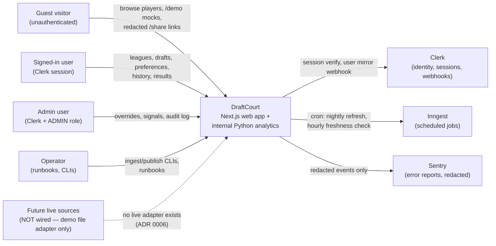

# System context (C4 Level 1)

Scope: DraftCourt as a black box plus the people and external systems it
interacts with. For containers, see `02-containers.md`.

## Actors

- **Guest visitor.** Browses public player/ranking pages, runs disposable
  `/demo` mock drafts via capability token, views redacted `/share/:token`
  result pages. No account, no persistent data.
  (BUILD_SPEC §8.1, §9.1; ADR 0014; ADR 0016 R6)
- **Signed-in user.** Clerk session mirrored to a `users` row via the
  signed Svix webhook. Owns leagues, drafts, preference profiles, custom
  ranks; reads own history and post-draft analysis. (ADR 0008 "Clerk
  webhook user mirror"; ADR 0009)
- **Admin user.** `USER` role by default; `ADMIN` only via
  server-controlled Clerk `publicMetadata.draftcourtRole` plus the database
  mirror — never from client claims. Manages projection overrides and
  typed player signals with mandatory rationale and redacted audit rows.
  (ADR 0009)
- **Operator.** Runs ingestion/publish CLIs, share/demo cleanup jobs, and
  the runbooks under `docs/runbooks/` and `docs/operations/`. No admin UI
  button triggers ingestion or projection runs (deliberate prohibition,
  ADR 0009).

## External systems

| System                                              | Relationship                                                                                           | Evidence                                                           |
| --------------------------------------------------- | ------------------------------------------------------------------------------------------------------ | ------------------------------------------------------------------ |
| Clerk                                               | Session verification on private routes; `POST /api/v1/webhooks/clerk` mirrors minimum profile          | ADR 0008; `apps/web/app/api/v1/webhooks/clerk/route.ts`            |
| Inngest                                             | Nightly source-refresh-and-publish (cron `0 6 * * *`), on-demand publish event, hourly freshness check | ADR 0008; `apps/web/lib/inngest/functions/`                        |
| Sentry                                              | Error reporting with `beforeSend` redaction on both web and analytics                                  | ADR 0004                                                           |
| Postgres / Redis / Neon / Upstash / Vercel / Render | Deployment topology, not wired beyond local Compose                                                    | `docker-compose.yml`; ADR 0004 (targets intended, not provisioned) |

## What is explicitly out of scope

- No live NBA statistics, injury, schedule, or ADP source is wired.
  The only adapter is `DemoFileAdapter` over committed synthetic fixtures
  (`data/demo/*.json`). Player/team/position names are real public facts;
  every statistic is fabricated (`docs/data-sources.md`,
  `data/attribution/demo-dataset.md`).
- No trained ML ensemble and no AI assistant runs in this deployment
  (baseline is deterministic; AI is premium/flag-gated future scope).
  No Phase 4 claims are made anywhere in these docs.

## Sources

- `BUILD_SPEC.md` §1–§3, §8.1, §9.1, §13
- `docs/adr/0001-monorepo-and-service-boundaries.md`
- `docs/adr/0004-local-dev-and-deployment-foundations.md`
- `docs/adr/0006-source-adapter-framework.md`
- `docs/adr/0008-background-jobs-and-caching.md`
- `docs/adr/0009-admin-authorization.md`
- `docs/adr/0014-guest-demo-mock-drafts.md`
- `docs/adr/0016-replay-and-private-sharing.md`
- `docs/data-sources.md`
- `docker-compose.yml`
- `.env.example` (names only)
