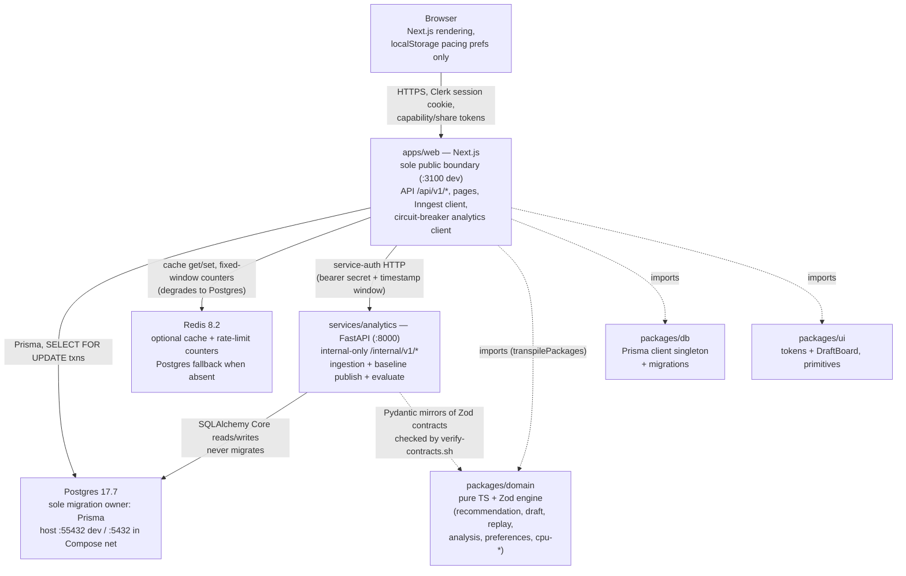

# Containers (C4 Level 2)

Runtime containers and their trust relationships. Component internals are
in `03-components.md`; data flows in `04-data-flows.md`.

## Container responsibilities

- **apps/web (Next.js).** The only browser-reachable server. Owns all
  `/api/v1/*` routes, pages, auth gating (`getCurrentUser` /
  `requireAdmin`), the event-sourced draft transaction, recommendation
  orchestration, share/demo capability endpoints, and Inngest function
  definitions. Dev default `next dev --port ${PORT:-3100}`
  (`apps/web/package.json`).
- **services/analytics (FastAPI).** Internal-only: no browser traffic.
  Exposes `/health/live`, `/health/ready`, and `/internal/v1/*`
  (ingestion, projection publish, model evaluation, job state).
  `POST /internal/v1/models/train` is deliberately absent — the Phase 1
  baseline is deterministic with no training stage (ADR 0008).
- **Postgres.** System of record. Prisma (`packages/db`) is the sole
  migration owner; Python uses SQLAlchemy Core `Table` mirrors and never
  migrates (ADR 0002; ADR 0005). Local Compose image `postgres:17.7-alpine`,
  host port `55432` by default to avoid colliding with a native Postgres
  (`docker-compose.yml:4-21`; ADR 0002).
- **Redis.** Optional acceleration: public-rankings cache and
  fixed-window rate-limit counters. Every rate-limit path has a Postgres
  `audit_log` fallback, so limits still hold with Redis down
  (`apps/web/lib/server/demo-rate-limit.ts`,
  `apps/web/lib/server/share-rate-limit.ts`).
- **packages/domain.** Zero dependency on Next.js/React/FastAPI: pure
  TypeScript + Zod so the engine is unit-testable without infrastructure
  (ADR 0001). Consumed server-side; client receives only computed payloads.
- **packages/db.** Prisma client singleton plus migrations; the generated
  client output is gitignored and regenerated by `prisma generate`
  (ADR 0002).

## Key cross-container contracts

- Web → analytics: bearer `ANALYTICS_SERVICE_SECRET`/`SERVICE_SECRET`
  plus `X-Request-Timestamp` inside ±300 s, `Idempotency-Key` per job
  kind, `X-Trace-Id` propagation
  (`services/analytics/app/api/internal.py:40-66`;
  `services/analytics/app/core/security.py` via ADR 0008).
- Analytics → web: RFC 9457 problems; exception text stays server-side
  (`services/analytics/app/api/internal.py:108-127`).
- Concurrency control is Postgres state (row locks, partial unique
  indexes), not Redis — single-instance scope stated honestly (ADR 0008;
  ADR 0010).

## Sources

- `docs/adr/0001-monorepo-and-service-boundaries.md`
- `docs/adr/0002-postgres-and-prisma-ownership.md`
- `docs/adr/0004-local-dev-and-deployment-foundations.md`
- `docs/adr/0005-phase1-data-model.md`
- `docs/adr/0008-background-jobs-and-caching.md`
- `docs/adr/0010-phase2-draft-core-and-recommendations.md`
- `services/analytics/app/api/internal.py`
- `services/analytics/app/main.py`
- `apps/web/lib/server/analytics-client.ts`
- `apps/web/lib/server/circuit-breaker.ts`
- `apps/web/package.json`
- `docker-compose.yml`
- `.env.example` (names only)
