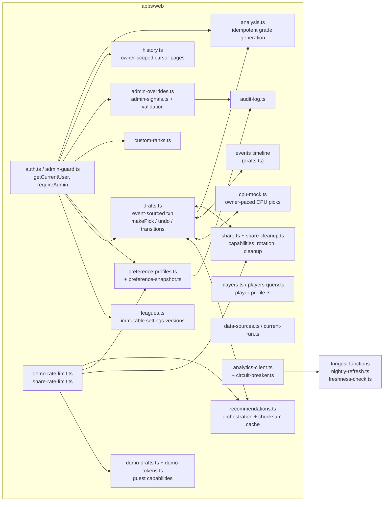
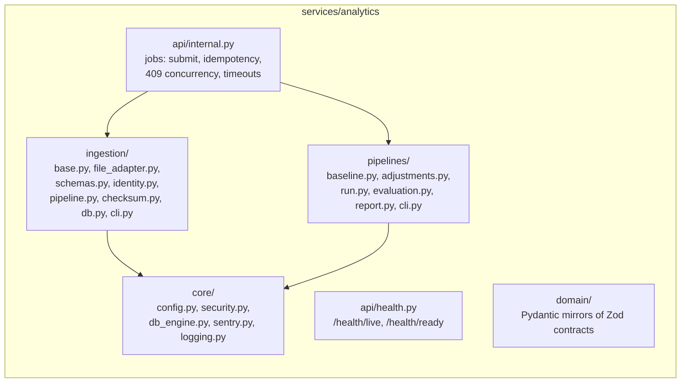

# Components (C4 Level 3)

One section per deployable. Only components that exist in code are listed;
there is no speculative "future service" here.

## apps/web (`apps/web/lib/server/` + `apps/web/app/api/`)

- `drafts.ts` is the single mutation path for human, CPU, and guest
  picks: one Postgres transaction (row lock → validate `If-Match` version
  → append immutable event → maintain `DraftRosterAssignment` → move snake
  cursor → bump version → write outbox). (ADR 0010)
- `recommendations.ts` serves checksum-addressed snapshots and the
  `4 requests / 30 s` per-draft recalculation gate
  (`apps/web/lib/server/recommendations.ts:252-268`).
- `preference-snapshot.ts` resolves override → league → default →
  built-in defaults once, inside the `DRAFT_STARTED` transaction, and
  never rewrites the snapshot. (ADR 0012)
- `demo-tokens.ts` mints 32-byte (256-bit) base64url capability tokens
  and SHA-256 rate-limit keys without storing raw material
  (`apps/web/lib/server/demo-tokens.ts:28-39,61-66,211-216`).

## services/analytics (`services/analytics/app/`)

- Pipeline work is invoked directly (`run_ingestion`,
  `publish_baseline_run`), never by shelling out to the Typer CLIs, so
  local/CI/production behavior is identical
  (`services/analytics/app/api/internal.py:279-308`).
- Job state machine PENDING → RUNNING → SUCCEEDED/FAILED/TIMEOUT lives in
  the Prisma-owned `analytics_jobs` table, accessed from Python via
  SQLAlchemy Core (`services/analytics/app/api/internal.py:161-266`).

## packages/domain (`packages/domain/src/`)

Pure modules with golden/property tests; no I/O, no wall-clock, no
network:

| Module                                     | Role                                                                            | Version constant                                                                           |
| ------------------------------------------ | ------------------------------------------------------------------------------- | ------------------------------------------------------------------------------------------ |
| `recommendation.ts`                        | Deterministic top-3 engine, canonical checksum, 250-run availability, lookahead | `ENGINE_VERSION = "phase3-preferences-1.0.0"` (verified in source; ADR 0012)               |
| `draft.ts`                                 | Snake math, slot resolution, `replayFromEvents`, `verifyReplayIntegrity`        | — (ADR 0010)                                                                               |
| `replay.ts`                                | Sequence-sliced pure reduction, `replayChecksum`, typed `ReplayError`           | `REPLAY_VERSION = "1.0.0"` (verified in source; ADR 0016)                                  |
| `analysis.ts`                              | Grade composite, 2000-run standing simulation                                   | `ANALYSIS_VERSION = "1.0.0"` (verified in source; ADR 0015)                                |
| `preferences.ts`                           | Settings envelope, normalization, 13 presets                                    | `PREFERENCE_SCHEMA_VERSION = 1` (verified in source; ADR 0011)                             |
| `cpu-personalities.ts` + `cpu-selector.ts` | 8 versioned personalities, seeded softmax selection                             | `CPU_PERSONALITY_VERSION = 1`, seed strategy v1 (ADR 0013; `cpu-personalities.ts:215-288`) |
| `contracts.ts`                             | Zod source of truth for cross-language schemas                                  | `packages/domain/src/scripts/generate-schemas.ts` emits `data/schemas/*.schema.json`       |
| `league-config.ts`                         | Scoring/slot validation vocabulary                                              | —                                                                                          |

## Sources

- `docs/adr/0008-background-jobs-and-caching.md`
- `docs/adr/0010-phase2-draft-core-and-recommendations.md`
- `docs/adr/0011-preference-storage-and-normalization.md`
- `docs/adr/0012-immutable-preference-snapshots.md`
- `docs/adr/0013-cpu-personalities-and-mock-drafts.md`
- `docs/adr/0014-guest-demo-mock-drafts.md`
- `docs/adr/0015-draft-analysis-and-history.md`
- `docs/adr/0016-replay-and-private-sharing.md`
- `services/analytics/app/api/internal.py`
- `apps/web/lib/server/recommendations.ts`
- `apps/web/lib/server/demo-tokens.ts`
- `apps/web/lib/server/demo-rate-limit.ts`
- `apps/web/lib/server/share-rate-limit.ts`
- `apps/web/lib/inngest/functions/freshness-check.ts`
- `apps/web/lib/inngest/functions/nightly-refresh.ts`
- `packages/domain/src/cpu-personalities.ts`
- `packages/domain/src/scripts/generate-schemas.ts`
