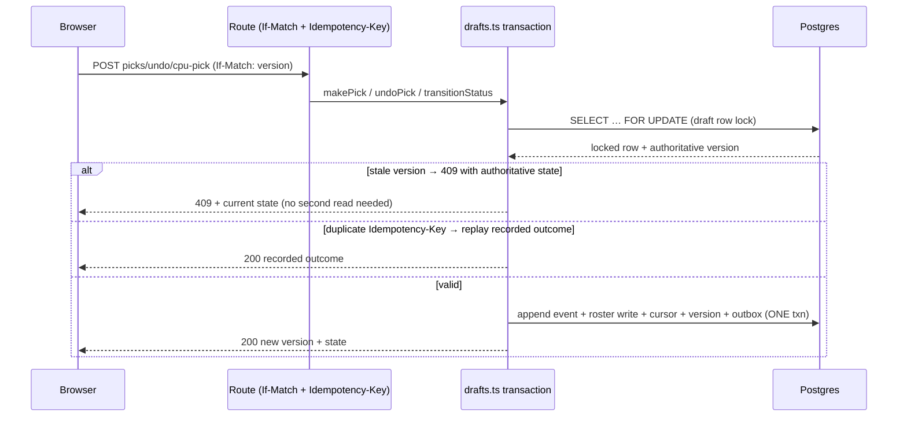
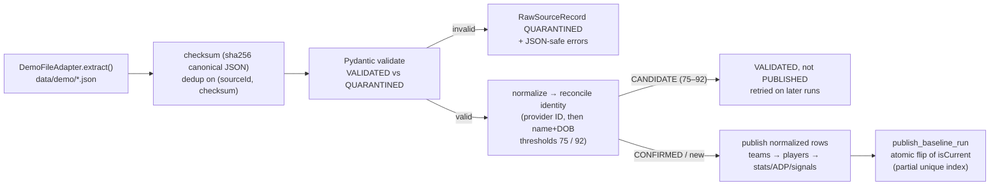
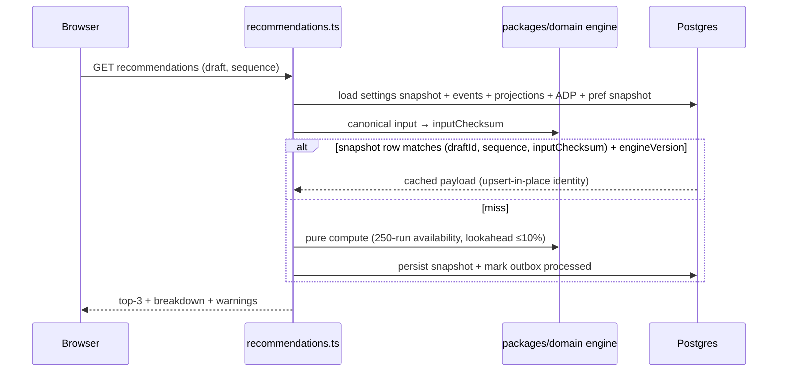
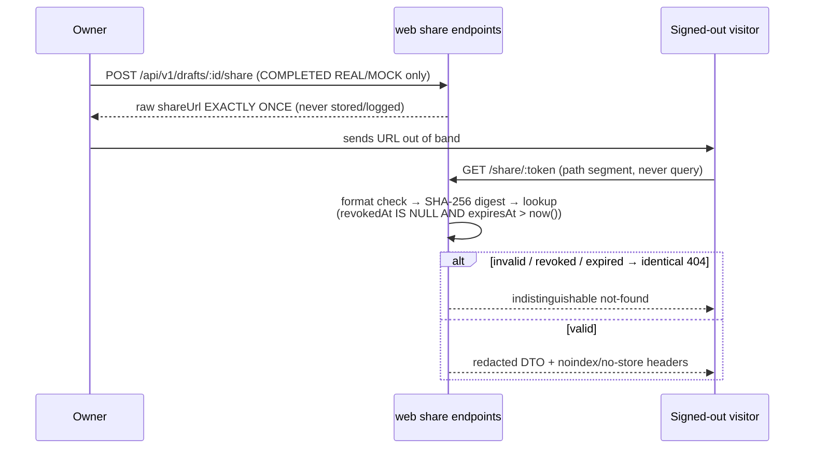

# Data flows

Six flows, each with participants, ordering guarantees, and failure
behavior. All fixtures below are illustrative, not production data.

## 1. Authenticated read (request flow)

```mermaid
sequenceDiagram
    participant B as Browser
    participant W as apps/web route
    participant A as auth.ts / admin-guard.ts
    participant P as Postgres (Prisma)
    B->>W: GET /api/v1/... (Clerk cookie)
    W->>A: getCurrentUser() → users row
    alt no session / no row → 401; row without ADMIN → 403
        W-->>B: RFC 9457 problem, no existence signal
    else authorized
        W->>P: owner-scoped query
        W-->>B: {data, error:null, meta:{traceId,...}}
    end
```

Owner authorization happens after authentication and before database
access where practical (BUILD_SPEC §8). Foreign IDs are indistinguishable
from missing IDs (uniform 404) on leagues, drafts, preferences, ranks,
history, analysis, and events (ADR 0009; ADR 0012; ADR 0015 D6; ADR 0016 R3).

## 2. Draft mutation (pick / undo / CPU pick / transitions)



One transaction path serves human, CPU, and guest picks; CPU decisions
run inside the same locked transaction via an internal decision provider,
and the CPU endpoint takes no player/team input (arbitrary-player
injection is structurally impossible). (ADR 0010; ADR 0013)

## 3. Ingestion → publish (analytics pipeline)



- Re-running is fully idempotent: same payloads checksum-skip; a new
  `IngestionRun` row records the no-op attempt (ADR 0006).
- Publishing is atomic: the partial unique index
  `projection_runs_one_current_per_season` rejects any transaction that
  would leave two current runs, so readers never see a half-published
  state (ADR 0005).
- Scheduled shape: Inngest `nightly-source-refresh-and-publish` (cron
  `0 6 * * *`, retries 3, concurrency 1, deterministic daily
  `Idempotency-Key`) calls the internal HTTP endpoints, never the CLI
  (ADR 0008).

## 4. Recommendation flow



No stale cache can touch pick legality: legality is enforced
transactionally against live tables, never from snapshots (ADR 0010).
Recalculation is gated at 4 requests / 30 s per draft
(`apps/web/lib/server/recommendations.ts:252-268`).

## 5. Analysis flow (post-draft grade)

Trigger: `GET /api/v1/drafts/:id/analysis` performs idempotent recovery
generation when a `COMPLETED` draft has no current `DraftAnalysis`
(preferred over a new outbox kind). Unique
`(draftId, analysisVersion, inputChecksum)` returns the cached row; a new
analysis version creates a new row, never an overwrite. Simulation
(2000 seeded runs) is computed outside the insert transaction.
(ADR 0015 D2, D5)

## 6. Sharing flow (private result link)



Rotation (`POST` on an existing row) issues version+1 and kills the old
digest in the same update; `DELETE` sets `revokedAt` (idempotent).
(ADR 0016 R4–R6; `docs/architecture/replay-and-sharing.md` §4–§7)

## Sources

- `docs/adr/0005-phase1-data-model.md`
- `docs/adr/0006-source-adapter-framework.md`
- `docs/adr/0008-background-jobs-and-caching.md`
- `docs/adr/0009-admin-authorization.md`
- `docs/adr/0010-phase2-draft-core-and-recommendations.md`
- `docs/adr/0012-immutable-preference-snapshots.md`
- `docs/adr/0013-cpu-personalities-and-mock-drafts.md`
- `docs/adr/0015-draft-analysis-and-history.md`
- `docs/adr/0016-replay-and-private-sharing.md`
- `docs/architecture/replay-and-sharing.md`
- `apps/web/lib/server/recommendations.ts`
- `apps/web/lib/api/envelope.ts`
- `services/analytics/app/api/internal.py`
