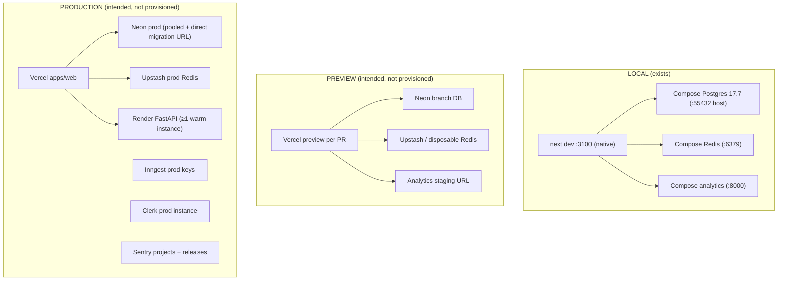

# Deployment topology

Three environments. Only local Compose exists as runnable infrastructure;
preview and production are intended targets recorded in ADR 0004, not
provisioned environments — nothing below should be read as a production
guarantee.

## Local Compose (the only runnable target)

`docker-compose.yml` provides `postgres` (17.7-alpine, host
`${POSTGRES_HOST_PORT:-55432}`), `redis` (8.2-alpine, `:6379`), and the
`analytics` multi-stage image (`python:3.12.5-slim` + `uv`, frozen sync
at build time, no network sync at startup). `apps/web` runs natively via
`next dev` for fast refresh; `docker compose up -d postgres redis` is
enough for the web loop, full `up -d` is needed for analytics
`/health/ready` against a real database. (ADR 0004; `docker-compose.yml`)

Bootstrap/quality gates: `pnpm bootstrap` (`scripts/bootstrap.sh`) and
`pnpm test:all` (`scripts/test-all.sh`); migrations via `pnpm db:migrate`,
seeding via `pnpm db:seed`, demo ingest via `pnpm demo:ingest`
(`package.json` scripts; BUILD_SPEC §18.1).

## Preview / production (intended shape, per BUILD_SPEC §18.2–§18.3)

Vercel previews per PR with Neon branch DBs and synthetic/demo data only;
production on Vercel + Neon (pooled runtime + direct migration URL) +
Upstash Redis + Render analytics + Inngest/Clerk/Sentry production
instances. Deploy workflows (`deploy-preview.yml`,
`deploy-production.yml`, `scheduled-data.yml`, `e2e.yml`) are specified in
BUILD_SPEC §17 but were **not observed** in `.github/workflows/` (only
`ci.yml`, `ml-validation.yml`, `security.yml` exist) — treat deployment
automation as planned, not present. **Unverified — do not cite as
operational.**

## Free-tier limits (honest accounting, ADR 0004 preserved)

| Risk                   | Stated consequence               | Upgrade trigger (BUILD_SPEC §18.3)              |
| ---------------------- | -------------------------------- | ----------------------------------------------- |
| Analytics cold starts  | Manual refreshes delayed         | Cold-start p95 exceeds recommendation SLO       |
| Limited scheduled jobs | Nightly publish may lag          | Job delay exceeds 15 minutes                    |
| Free DB suspend/caps   | Suspended or capped usage        | Connection/compute limits approach 70%          |
| Untested concurrency   | Behavior beyond fixtures unknown | Concurrent active drafts exceed tested capacity |

No load, capacity, or cold-start numbers are claimed here: no measured
free-tier figures exist in the repo. Benchmark fixtures measure engine
latency on a developer machine only (`docs/benchmarks/METHODOLOGY.md`).

## Sources

- `docs/adr/0004-local-dev-and-deployment-foundations.md`
- `docs/adr/0002-postgres-and-prisma-ownership.md`
- `BUILD_SPEC.md` §17, §18.1–§18.3
- `docker-compose.yml`
- `package.json` (scripts: `bootstrap`, `test:all`, `db:migrate`, `db:seed`, `demo:ingest`)
- `.github/workflows/` (observed: `ci.yml`, `ml-validation.yml`, `security.yml`)
- `docs/benchmarks/METHODOLOGY.md`
