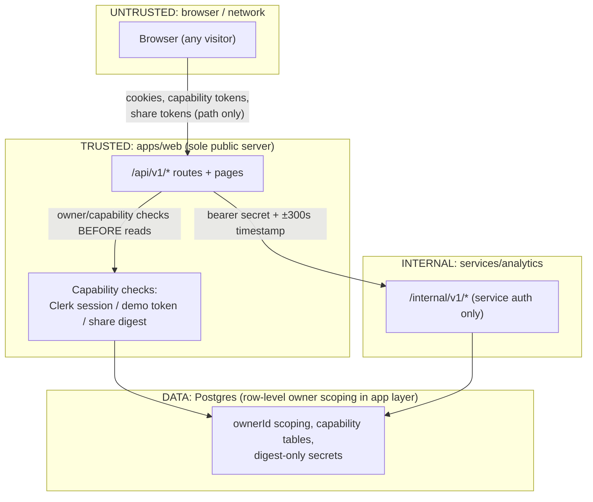

# Trust boundaries

## Boundaries

1. **Internet → apps/web.** The only browser-reachable server. Every
   private route verifies the Clerk session; every guest/share route
   validates its capability. Static security headers plus per-request CSP
   nonce (`script-src` never `unsafe-inline`) are unit-tested pure
   functions (`apps/web/lib/security-headers.ts`,
   `apps/web/lib/content-security-policy.ts`). (ADR 0004)
2. **apps/web → services/analytics.** Browsers never reach it. Every
   `/internal/v1/*` call carries the shared bearer secret (constant-time
   compare) plus `X-Request-Timestamp` inside
   `SERVICE_AUTH_TIMESTAMP_WINDOW_SECONDS` (default ±300 s);
   unauthenticated callers get 401 problems with no oracle detail
   (`services/analytics/app/api/internal.py:141-157`; `.env.example:50-53`).
3. **App → database.** Prisma owns migrations; Python touches only
   mirrored tables via SQLAlchemy Core and never migrates (ADR 0002,
   ADR 0005). Ownership is enforced in the service layer (`ownerId`
   scoping), not by database RLS — a deliberate, documented choice, so
   every new route must include its ownership test.
4. **Capability stores.** Raw demo tokens and raw share tokens are never
   persisted: demo keeps a PBKDF2-HMAC-SHA256 hash (100k iterations),
   sharing keeps a hex SHA-256 digest; comparisons are constant-time.
   (ADR 0014; ADR 0016 R4)

## Auth / access matrix

| Capability                                                     | Clerk session           | Owner of resource        | Demo token                  | Share digest            | Admin role                                 | Scope                                         |
| -------------------------------------------------------------- | ----------------------- | ------------------------ | --------------------------- | ----------------------- | ------------------------------------------ | --------------------------------------------- |
| Public players/rankings/sources                                | –                       | –                        | –                           | –                       | –                                          | Safe fields only                              |
| Leagues / drafts / prefs / ranks / history / analysis / events | required                | required (404 otherwise) | –                           | –                       | –                                          | Owner rows only; `DEMO` excluded from history |
| Admin overrides / signals / audit-log                          | required                | –                        | –                           | –                       | required (401 vs 403, no existence signal) | All rows, redacted                            |
| `/demo-drafts/*` lifecycle                                     | – (must be absent path) | – (`ownerId` NULL)       | required (cookie or bearer) | –                       | –                                          | Exactly one demo draft                        |
| `/share/:token` public view                                    | –                       | –                        | –                           | required (path segment) | –                                          | One completed REAL/MOCK result, redacted      |
| `/internal/v1/*`                                               | –                       | –                        | –                           | –                       | –                                          | Service secret + timestamp only               |

Notes: 401 = unauthenticated, 403 = authenticated but not admin, 404 =
missing-or-foreign (no enumeration oracle) on all owner/capability paths
(ADR 0009; ADR 0014 D3; ADR 0016 R4–R7). Guest demos are never shareable
(`shareTokenHash` stays NULL) and never appear in history (ADR 0014 D2;
ADR 0015 D6). Share capabilities authorize no mutation and no owner API;
demo and share digests live in separate tables and are non-interchangeable
(ADR 0016 R6–R7).

## Sources

- `docs/adr/0004-local-dev-and-deployment-foundations.md`
- `docs/adr/0008-background-jobs-and-caching.md`
- `docs/adr/0009-admin-authorization.md`
- `docs/adr/0012-immutable-preference-snapshots.md`
- `docs/adr/0014-guest-demo-mock-drafts.md`
- `docs/adr/0015-draft-analysis-and-history.md`
- `docs/adr/0016-replay-and-private-sharing.md`
- `docs/architecture/replay-and-sharing.md` §6–§7
- `apps/web/lib/server/auth.ts`
- `apps/web/lib/api/admin-guard.ts`
- `apps/web/lib/api/envelope.ts`
- `services/analytics/app/api/internal.py`
- `.env.example` (names only)
