# Entity-relationship diagram

Status: Phase 2 (league setup + live draft core). Covers the Phase 0/1
tables plus the Phase 2 additions from migrations
`20260822230519_phase2_leagues`, `20260822230948_phase2_draft_core` and
`20260822232938_phase2_draft_outbox`. Preference/AI tables remain future
phases — see `BUILD_SPEC.md` section 4.2.

Source of truth is always `packages/db/prisma/schema.prisma`; this diagram
is a human-readable view of it and should be regenerated by hand whenever
the schema changes materially (there is no auto-generation step in CI —
see `docs/adr/0005-phase1-data-model.md`).

```mermaid
erDiagram
    User ||--o{ PlayerExternalIdentity : "reviews (nullable)"
    User ||--o{ PlayerNewsSignal : "creates (nullable)"
    User ||--o{ ProjectionOverride : "authors"
    User ||--o{ AuditLog : "acts as (nullable)"

    NbaTeam ||--o{ Player : "currentTeam (nullable)"

    Player ||--o{ PlayerExternalIdentity : "resolved to (nullable)"
    Player ||--o{ PlayerEligibility : "has"
    Player ||--o{ PlayerSeasonStat : "has"
    Player ||--o{ PlayerNewsSignal : "has"
    Player ||--o{ AdpObservation : "has"
    Player ||--o{ AdpConsensusPlayer : "has"
    Player ||--o{ PlayerProjection : "has"
    Player ||--o{ ProjectionOverride : "targeted by"

    DataSource ||--o{ IngestionRun : "runs"
    DataSource ||--o{ RawSourceRecord : "produces"
    DataSource ||--o{ PlayerSeasonStat : "sourced (nullable)"
    DataSource ||--o{ PlayerNewsSignal : "sourced (nullable)"
    DataSource ||--o{ AdpObservation : "sourced"
    DataSource ||--o{ PlayerExternalIdentity : "maps"

    IngestionRun ||--o{ RawSourceRecord : "contains"
    RawSourceRecord ||--o{ PlayerSeasonStat : "normalized into (nullable)"

    AdpConsensusSnapshot ||--o{ AdpConsensusPlayer : "contains"

    ProjectionModel ||--o{ ProjectionRun : "produces"
    ProjectionRun ||--o{ PlayerProjection : "contains"
    ProjectionRun ||--o{ ProjectionOverride : "applied within (nullable)"
    ProjectionOverride ||--o{ ProjectionOverride : "supersedes (nullable, self)"

    User {
        uuid id PK
        string clerkUserId UK
        enum role
    }

    NbaTeam {
        uuid id PK
        string nbaProviderId UK
        string abbreviation UK
        string name
        string colorPrimary
        string colorSecondary
    }

    Player {
        uuid id PK
        string slug UK
        string displayName
        string legalName
        date dob
        enum status "Availability"
        bool unsigned
        bool rookie
        uuid currentTeamId FK "nullable"
    }

    PlayerExternalIdentity {
        uuid id PK
        uuid sourceId FK
        string externalId
        uuid playerId FK "nullable until resolved"
        string candidateName
        float matchConfidence
        enum matchMethod
        enum status "CONFIRMED/CANDIDATE/REJECTED"
    }

    PlayerEligibility {
        uuid id PK
        uuid playerId FK
        string season
        enum position "EligiblePosition"
    }

    PlayerSeasonStat {
        uuid id PK
        uuid playerId FK
        string season
        enum scope "NBA/COLLEGE/INTERNATIONAL"
        int gamesPlayed
        float minutesTotal
        float pts_reb_ast_stl_blk_tov
        float fgm_fga_ftm_fta_threePm
        uuid sourceId FK "nullable"
        uuid sourceRecordId FK "nullable"
    }

    DataSource {
        uuid id PK
        string name UK
        enum adapterType "FILE/API"
        bool enabled
        string attribution
        string[] permittedUses
        datetime lastComplianceReviewAt
    }

    IngestionRun {
        uuid id PK
        uuid sourceId FK
        enum status
        int recordsExtracted_Validated_Quarantined_Published
        string traceId
        datetime startedAt
        datetime finishedAt
    }

    RawSourceRecord {
        uuid id PK
        uuid sourceId FK
        uuid ingestionRunId FK
        string externalKey
        string checksum "UK with sourceId"
        json payload
        enum status "PENDING/VALIDATED/QUARANTINED/PUBLISHED"
        json validationErrors "nullable"
    }

    PlayerNewsSignal {
        uuid id PK
        uuid playerId FK
        enum type "INJURY/TRADE/STARTER_CHANGE/ROLE_UP/ROLE_DOWN"
        float impact
        float confidence
        bool adminApproved
        datetime effectiveAt
        datetime expiresAt "nullable"
    }

    AdpObservation {
        uuid id PK
        uuid playerId FK
        uuid sourceId FK
        string format
        string season
        int sampleSize
        decimal adp
        int rank
        datetime capturedAt
    }

    AdpConsensusSnapshot {
        uuid id PK
        string season
        string format
        string methodologyVersion
        datetime capturedAt
    }

    AdpConsensusPlayer {
        uuid id PK
        uuid snapshotId FK
        uuid playerId FK
        decimal consensusAdp
        decimal dispersion
        int sourcesCount
        float valueConfidence
    }

    ProjectionModel {
        uuid id PK
        string modelKey "UK with version"
        string version "UK with modelKey"
        string algorithm
        string featureSchemaChecksum
        json metrics "nullable"
        enum status "DRAFT/ACTIVE/DEPRECATED/ARCHIVED"
    }

    ProjectionRun {
        uuid id PK
        uuid modelId FK
        string season
        datetime dataCutoff
        enum status
        bool isCurrent "at most one true per season (partial unique index)"
        datetime publishedAt "nullable"
    }

    PlayerProjection {
        uuid id PK
        uuid runId FK "UK with playerId"
        uuid playerId FK
        float games_minutesPerGame
        float pts_reb_ast_stl_blk_tov
        float fgm_fga_ftm_fta_threePm
        json lower80
        json upper80
        float injuryRisk_consistency_upside_roleSecurity
        int overallRank
    }

    ProjectionOverride {
        uuid id PK
        uuid adminId FK
        uuid playerId FK
        uuid projectionRunId FK "nullable"
        string stat
        decimal deltaValue "nullable, XOR with replacementValue"
        decimal replacementValue "nullable, XOR with deltaValue"
        string rationale "CHECK non-empty"
        enum status "ACTIVE/EXPIRED/SUPERSEDED/REVOKED"
        uuid supersedesId FK "nullable, self"
    }

    AuditLog {
        uuid id PK
        uuid actorId FK "nullable"
        string action
        string entityType
        string entityId
        json beforeJson "redacted, nullable"
        json afterJson "redacted, nullable"
        string traceId
    }

    User ||--o{ League : "owns"
    League ||--o{ LeagueSettingsVersion : "versions (immutable)"
    League ||--o{ LeagueTeam : "has"
    League |o--o| LeagueSettingsVersion : "active settings pointer"
    League ||--o{ Draft : "hosts"

    User ||--o{ Draft : "owns"
    Draft ||--o{ DraftTeam : "immutable team snapshots"
    Draft ||--o{ DraftEvent : "append-only log"
    Draft ||--o{ DraftRosterAssignment : "materialized read model"
    Draft ||--o{ RecommendationSnapshot : "immutable by checksum"
    Draft ||--o{ DraftOutbox : "recommendation work requests"

    DraftEvent |o--o| DraftRosterAssignment : "source event"
    DraftEvent |o--o{ DraftEvent : "PICK_UNDONE causation"
```

## Notes on constraints Mermaid can't show

A few Phase 1 constraints exist only in the migration SQL, not expressible
in Prisma's schema DSL (see `docs/adr/0005-phase1-data-model.md` for why
each was hand-added rather than generated):

- `projection_runs_one_current_per_season`: partial unique index on
  `("season") WHERE "isCurrent" = true` — the mechanism behind atomic
  projection publish.
- `projection_overrides_value_xor_check` / `..._rationale_check`: exactly
  one of `deltaValue`/`replacementValue` set, and a non-empty rationale.
- `player_season_stats_fg_check` / `..._ft_check`: `fgm <= fga`,
  `ftm <= fta` at the database level (defense in depth — the ingestion
  pipeline's Pydantic validation already enforces this pre-insert).
- `players_displayName_trgm_idx`: a `pg_trgm` GIN index backing player
  name search.

Phase 2 additions in the same style:

- `leagues_team_count_check` (4–20), `leagues_user_draft_slot_check`
  (1..teamCount), `leagues_rounds_check`, `leagues_playoff_weeks_check`.
- `league_settings_versions`: unique `(leagueId, versionNumber)`; versions
  are write-once (enforced by the service transaction, see ADR 0010).
- `draft_events`: unique `(draftId, sequence)` and
  `(draftId, idempotencyKey)`; `draft_roster_assignments`: unique
  `(draftId, playerId)` = at most one effective selection per player.
- `recommendation_snapshots`: unique `(draftId, sequence, inputChecksum)` —
  identical inputs upsert in place (immutable-by-checksum semantics).

## Cross-language write boundary

Prisma (`packages/db`) is the sole schema/migration owner. The analytics
service (`services/analytics`) writes to `RawSourceRecord`, `Player`,
`PlayerEligibility`, `PlayerSeasonStat`, `PlayerExternalIdentity`,
`AdpObservation`, `PlayerNewsSignal`, `ProjectionModel`, `ProjectionRun`,
and `PlayerProjection` through SQLAlchemy Core `Table` objects
(`services/analytics/app/ingestion/db.py`) that mirror the exact
`@@map`'d snake_case table names / camelCase quoted column names Prisma
generates — it never runs a migration.
